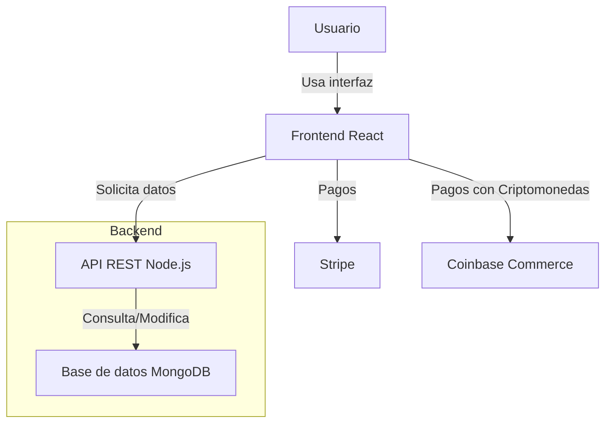

# Fases Resueltas

## Planificación y Análisis de Requisitos

| **Requisito**                                        | **Plazo de entrega**    |
|------------------------------------------------------|-------------------------|
| **Catálogo de productos**                            | 2 semanas               |
| **Carrito de compras**                               | 1 semana                |
| **Registro e inicio de sesión de usuarios**          | 2 semanas               |
| **Historial de pedidos y gestión de cuentas**        | 1 semana                |
| **Proceso de pago y opciones (Stripe y Coinbase)**   | 2 semanas               |
| **Notificaciones por correo electrónico**            | 1 semana                |
| **Seguimiento de pedidos en tiempo real**            | 1 semana                |
| **Rendimiento y escalabilidad**                      | En paralelo con la implementación |
| **Seguridad (SSL, cifrado, protección XSS/CSRF)**    | En paralelo con la integración de pagos |
| **Compatibilidad (diseño responsivo)**               | Durante todo el desarrollo |
| **Mantenimiento (código limpio, plan de actualizaciones)** | Al final del proyecto   |
| **Pruebas de rendimiento, seguridad y escalabilidad** | 2 semanas               |
| **Pruebas de compatibilidad**                        | 1 semana                |
| **Despliegue y puesta en producción**                | 1 semana                |

Este cronograma distribuye el trabajo a lo largo de los 3 meses de desarrollo, con tiempos dedicados a cada uno de los requisitos esenciales.

## **Definición de Requisitos**
### Requisitos Funcionales

- **Catálogo de productos**: Los usuarios podrán ver todos los productos organizados por categorías.
	- Subfunción: Los usuarios pueden hacer clic en un producto para ver detalles como la descripción, el precio y características adicionales.

- **Carrito de compras**: Los usuarios podrán añadir productos a un carrito de compras.
	- Subfunción: El carrito debe poder actualizarse con cambios de cantidad y eliminación de productos.

- **Registro e inicio de sesión**: Los usuarios podrán registrarse con su correo electrónico y gestionar su cuenta.
	- Subfunción: Los usuarios podrán iniciar sesión, revisar sus compras anteriores y actualizar información personal como la dirección de envío.

- **Historial de compras**: Los usuarios tendrán acceso a un historial de pedidos anteriores, donde podrán ver detalles de cada compra.

- **Proceso de pago**: Los usuarios podrán pagar usando varios métodos, como tarjeta de crédito o PayPal.
   	- Subfunción: Verificar el costo del envío antes del pago y confirmar el pedido.

- **Notificaciones de pedidos**: Los usuarios recibirán notificaciones por correo electrónico sobre el estado de su pedido, como confirmación de compra y envío.
   
- **Seguimiento de pedidos**: Los usuarios podrán seguir el estado de sus pedidos en tiempo real una vez que hayan sido enviados.

### Requisitos No Funcionales

- **Usabilidad**: La interfaz debe ser fácil de usar e intuitiva, con una navegación fluida entre las secciones del catálogo, carrito de compras y gestión de cuentas.

- **Rendimiento**: La aplicación debe poder soportar múltiples usuarios simultáneamente, manteniendo tiempos de respuesta rápidos, especialmente durante el proceso de pago.

- **Seguridad**: El sistema debe manejar de manera segura los datos de los usuarios y sus transacciones, asegurando la privacidad de la información personal y los datos financieros.

- **Disponibilidad**: La plataforma debe estar disponible 24/7, con un mínimo de tiempo de inactividad durante actualizaciones o mantenimiento.

- **Escalabilidad**: El sistema debe ser capaz de manejar el crecimiento en la cantidad de productos, usuarios y transacciones sin degradar el rendimiento.

- **Compatibilidad**: La aplicación debe ser accesible en distintos dispositivos (móviles, tablets, desktops) y navegadores modernos.

- **Mantenibilidad**: El código de la aplicación debe estar bien documentado para facilitar futuras actualizaciones o correcciones.

## **Diseño de la Arquitectura**

  - Frontend desarrollado en **React** para una interfaz ágil y responsiva, adaptada a móviles y tablets.
  - Backend con **Node.js** y una API REST para manejar operaciones de usuario, carrito y pagos.
  - Base de datos **MongoDB** para gestionar los productos, usuarios y pedidos.
  - Integración de la pasarela de pago **Stripe** para tarjetas y **Coinbase Commerce** para criptomonedas.

## **Implementación**

  - Configurar la API REST para gestionar el catálogo de productos, el carrito y los pagos.
  - Crear interfaces atractivas con React, incluyendo un sistema de recomendación de productos.
  - Integrar las opciones de pago y configurar los cupones de descuento en tiempo real.

## **Pruebas**

  - Realizar pruebas de carga con herramientas como **JMeter** para ver cómo responde la plataforma bajo la demanda de múltiples usuarios.
  - Testear todos los flujos de compra y la funcionalidad del carrito con diferentes dispositivos y navegadores.

## **Despliegue y Mantenimiento**

  - Desplegar la aplicación en **AWS** para asegurar escalabilidad, con balanceadores de carga y respaldo automatizado.
  - Monitorear el rendimiento de la aplicación usando **CloudWatch**, y establecer ciclos de actualización periódicos para mejoras y nuevos lanzamientos de productos.
