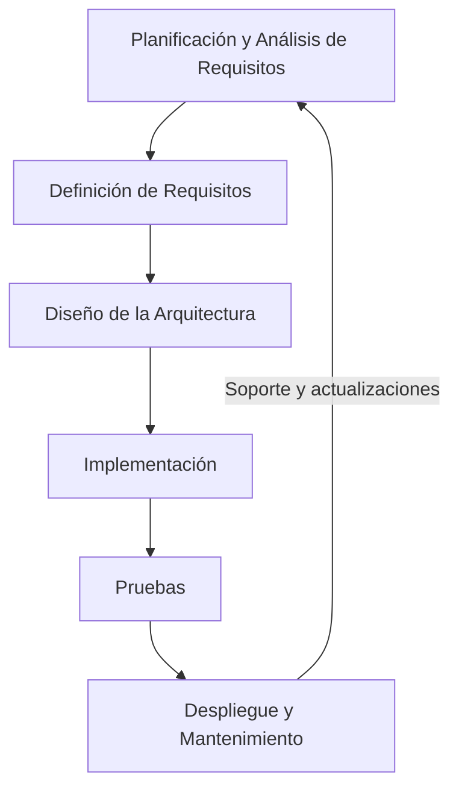
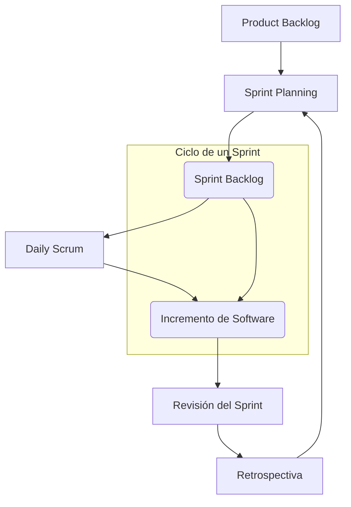

El desarrollo de software puede parecer simple en un inicio: "Solo necesito una idea", pensamos. Sin embargo, en cuanto comenzamos a trabajar en un proyecto, nos damos cuenta de que surgen cientos de inconvenientes. El principal problema suele ser la **falta de organización**. Cuando un proyecto requiere varias pantallas o módulos, terminamos perdiendo mucho tiempo haciendo ajustes sobre la marcha. 

Para evitar esto, es fundamental seguir una serie de **fases de desarrollo** que nos ayuden a minimizar estos problemas desde el principio. A continuación, te presento las etapas clave del desarrollo de software, que suelen ser el pilar para cualquier proyecto bien gestionado.

## Etapas del Desarrollo de Software

### 1. Planificación y Análisis de Requisitos
Aquí es donde todo comienza. Junto al cliente, analizamos sus necesidades y definimos los objetivos del proyecto. Se trata de comprender a fondo qué funcionalidades debe tener el software y cómo estas se alinean con las expectativas del usuario. Esta etapa es crucial porque una buena planificación previene sorpresas y problemas más adelante.

Si no hacemos este trabajo a conciencia, es probable que durante las revisiones posteriores, el cliente mencione características que pensaba que ya estaban incluidas. Esto puede generar retrasos importantes en el proyecto.

!!! warning "Ojo con los cambios"

    Los clientes suelen ser caprichosos, y la mayoría no tiene conocimientos técnicos. A menudo, a mitad del proyecto o al ver el avance del producto, se les ocurre alguna nueva funcionalidad que desean implementar. Aquí es donde debes negociar con ellos para obtener más tiempo si esa nueva idea se va a llevar a cabo.

Aquí tienes la sección revisada con la explicación ampliada sobre los requisitos funcionales y no funcionales:

---

### 2. Definición de Requisitos

Después de entender lo que el cliente necesita, se procede a documentar los **requisitos específicos** del sistema. Aquí definimos dos tipos principales de requisitos que guiarán el desarrollo del software:

#### Requisitos Funcionales

**Definición**: Los requisitos funcionales describen **qué debe hacer el software**. Estos requisitos especifican las funcionalidades, características y comportamientos que el sistema debe implementar para cumplir con las necesidades del usuario. En otras palabras, definen las acciones que el sistema debe ser capaz de realizar.

- **Ejemplos**:
    - El sistema debe permitir a los usuarios registrarse con una dirección de correo electrónico.
    - El software debe permitir la búsqueda de productos por categoría y palabras clave.
    - Los usuarios deben poder realizar pagos utilizando tarjetas de crédito y PayPal.

#### Requisitos No Funcionales

**Definición**: Los requisitos no funcionales se centran en **cómo debe comportarse el software** en términos de rendimiento, seguridad, usabilidad y otras características cualitativas. Estos requisitos son cruciales para garantizar que el sistema funcione de manera eficiente y satisfactoria en el entorno real.

- **Ejemplos**:
    - El sistema debe ser capaz de manejar al menos 1000 usuarios simultáneamente sin degradar el rendimiento.
    - La aplicación debe cumplir con los estándares de accesibilidad para usuarios con discapacidades.
    - Las transacciones deben ser seguras y cumplir con las normativas de protección de datos.

Esta documentación de requisitos funcionales y no funcionales será nuestra guía durante el desarrollo para asegurarnos de que todos estemos alineados y que el software cumpla con las expectativas del cliente.

### 3. Diseño de la Arquitectura
En esta fase, se define cómo se va a organizar el software, qué componentes tendrá y cómo interactuarán entre sí. Un buen diseño de arquitectura facilita la implementación y, más adelante, el mantenimiento. 

!!! info "Eligiendo la arquitectura adecuada"

    Existen muchas arquitecturas de software. Las más tradicionales, como las **arquitecturas monolíticas**, han ido dando paso a **arquitecturas de microservicios**, donde cada parte del software se maneja de forma independiente. Esto facilita las modificaciones y la gestión de errores.

### 4. Implementación
Aquí es donde realmente nos ponemos manos a la obra con la codificación. Tomamos los requisitos y el diseño que ya hemos definido y los convertimos en código. Es fundamental seguir buenas prácticas de programación para garantizar que el software sea de calidad y no presente problemas en el futuro.

### 5. Pruebas
Una vez que hemos desarrollado el software, es el momento de probarlo. Las pruebas son esenciales para verificar que el producto cumple con los requisitos que definimos al principio. Incluyen pruebas unitarias, de integración y de sistema, y nos ayudan a identificar y corregir errores antes de que el software sea lanzado al cliente.

!!! danger "No escatimes en pruebas"

    En algunos enfoques ágiles, se minimiza la fase de pruebas, pero cuando el software crece en tamaño y complejidad, esta fase es crucial para evitar errores que nos costarán mucho más tiempo arreglar después.

#### Entornos de Pruebas

Para una evaluación efectiva del software, se utilizan varios entornos de pruebas, cada uno con un propósito específico:

1. **Entorno de Desarrollo**:
    - **Descripción**: Espacio donde los desarrolladores crean y modifican el código. Aquí se realizan pruebas unitarias y básicas de integración.
    - **Características**: Facilita el desarrollo y pruebas iniciales del código.

2. **Entorno de Pruebas (QA)**:
    - **Descripción**: Entorno dedicado a la ejecución de pruebas exhaustivas del software, incluyendo pruebas de sistema y de aceptación del usuario.
    - **Características**: Replica el entorno de producción, sin afectar a los usuarios finales.

3. **Entorno de Preproducción**:
    - **Descripción**: Último entorno antes del despliegue en producción, usado para la validación final del sistema en condiciones similares a producción.
    - **Características**: Permite pruebas finales de carga y rendimiento.

4. **Entorno de Producción**:
    - **Descripción**: El entorno real donde el software es utilizado por los usuarios finales.
    - **Características**: Los errores en este entorno pueden tener un impacto significativo, por lo que se deben hacer pruebas exhaustivas en los entornos anteriores.

#### QA (Quality Assurance)

El aseguramiento de la calidad (QA) es un proceso integral que asegura que el software cumpla con los estándares de calidad. Incluye:

- **Prevención de Defectos**: Implementación de prácticas y procesos para evitar errores.
- **Pruebas Sistemáticas**: Ejecución de pruebas para identificar y corregir defectos antes del lanzamiento.
- **Documentación y Gestión**: Registro y seguimiento de defectos encontrados y su resolución.

QA es crucial no solo para encontrar errores, sino para garantizar que el software sea robusto y fiable desde el principio hasta el final del ciclo de desarrollo.

### 6. Despliegue y Mantenimiento
Finalmente, llega el momento de poner el software en funcionamiento en el entorno de **producción**. Esto puede incluir la instalación del software en los sistemas del cliente y capacitar a los usuarios. Después de la entrega, el mantenimiento es una actividad continua que abarca la corrección de errores y la actualización del sistema conforme el cliente lo requiera. En esta fase, el desarrollador suele seguir recibiendo una remuneración por el soporte y las mejoras del software.

## Metodologías Ágiles

Las metodologías ágiles son un conjunto de principios y prácticas para gestionar proyectos de desarrollo de software. Se centran en la **colaboración continua** con el cliente, la **flexibilidad** para adaptarse a cambios, y la entrega frecuente de software funcional.

Una de las metodologías ágiles más populares es **Scrum**, que organiza el desarrollo en ciclos cortos e iterativos llamados **sprints**.

### Metodología Scrum

Scrum es una metodología ágil que se enfoca en la **entrega rápida y continua** de software funcional. Cada **sprint** suele durar entre 1 y 4 semanas, y en ese tiempo se desarrollan características completas que pueden ser probadas y revisadas. El equipo de Scrum se organiza en tres roles principales:

| **Rol**          | **Descripción**                                                                 |
|------------------|---------------------------------------------------------------------------------|
| **Product Owner** | Define la visión del producto y prioriza las características.                   |
| **Scrum Master**  | Facilita el proceso Scrum, asegurando que se siga el marco metodológico.        |
| **Equipo de Desarrollo** | Desarrolla, prueba y entrega las funcionalidades acordadas en cada sprint. |

### Ciclo Scrum

#### Fases del Ciclo Scrum:

1. **Product Backlog**: Es una lista priorizada de todas las características o tareas que el producto debe incluir. El **Product Owner** es el responsable de mantener y priorizar este backlog.
  
2. **Sprint Planning**: El equipo selecciona las tareas más importantes del backlog que puedan completarse durante el sprint. Estas tareas forman el **Sprint Backlog**.

3. **Sprint**: El equipo trabaja en las tareas seleccionadas durante el tiempo del sprint, realizando **Daily Scrums** (reuniones diarias de seguimiento) para discutir el progreso y resolver impedimentos.

4. **Incremento de Software**: Al final del sprint, el equipo debe entregar un incremento de software funcional que puede ser revisado.

5. **Revisión del Sprint**: El equipo muestra lo que se ha desarrollado durante el sprint a los interesados y obtiene feedback.

6. **Retrospectiva del Sprint**: El equipo analiza lo que funcionó bien y lo que no, y define acciones de mejora para futuros sprints.

#### Beneficios de Scrum

- **Adaptabilidad**: Permite cambios y ajustes en función de los comentarios del cliente o del mercado.
- **Colaboración**: Fomenta la interacción constante entre el equipo de desarrollo y los interesados.
- **Entrega rápida**: Los sprints cortos garantizan entregas frecuentes de software funcional.

#### Sprints

Cada sprint tiene una duración fija y produce un resultado que se puede mostrar al cliente. Esto asegura que se ve progreso de manera constante y que el producto se desarrolla de manera iterativa. El equipo tiene la libertad de ajustar la carga de trabajo en función del feedback recibido al final de cada sprint.

- **Duración**: De 1 a 4 semanas.
- **Objetivo**: Completar una serie de tareas del **Sprint Backlog** que tengan valor para el usuario final.

#### Ciclo de Retroalimentación Continua

Scrum está diseñado para recibir y procesar retroalimentación de forma continua, lo que permite mejorar tanto el producto como el proceso de desarrollo. La **retroalimentación constante** durante y al final de cada sprint ayuda a asegurar que el software se ajuste a las necesidades del cliente.

Scrum es ideal para proyectos donde los requisitos no están completamente definidos desde el principio y donde se espera que haya muchos cambios a lo largo del tiempo.