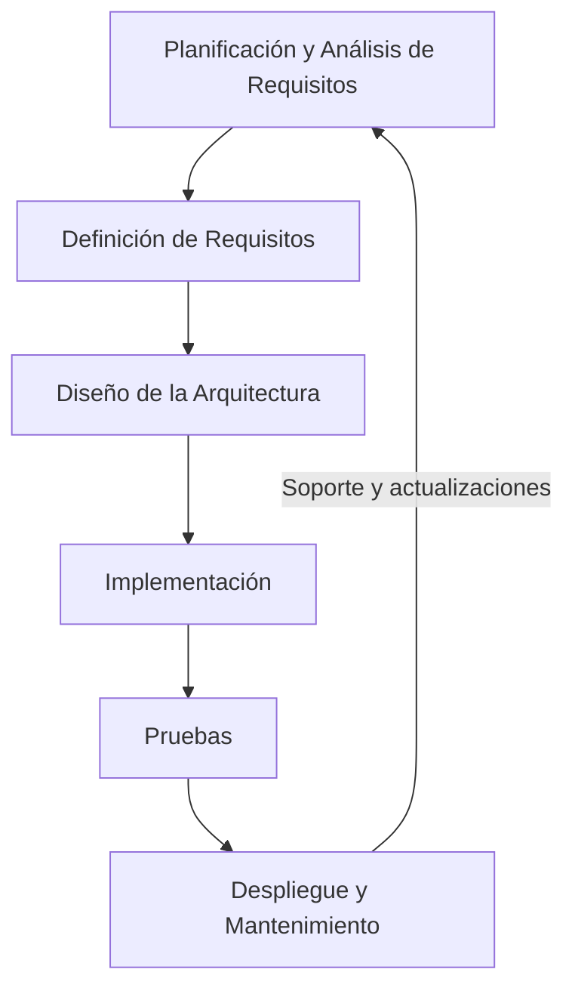

El desarrollo de software puede parecer simple en un inicio: "Solo necesito una idea", pensamos. Sin embargo, en cuanto comenzamos a trabajar en un proyecto, nos damos cuenta de que surgen cientos de inconvenientes. El principal problema suele ser la **falta de organización**. Cuando un proyecto requiere varias pantallas o módulos, terminamos perdiendo mucho tiempo haciendo ajustes sobre la marcha. 

Para evitar esto, es fundamental seguir una serie de **fases de desarrollo** que nos ayuden a minimizar estos problemas desde el principio. A continuación, te presento las etapas clave del desarrollo de software, que suelen ser el pilar para cualquier proyecto bien gestionado.

## Etapas del Desarrollo de Software

### 1. Planificación y Análisis de Requisitos
Aquí es donde todo comienza. Junto al cliente, analizamos sus necesidades y definimos los objetivos del proyecto. Se trata de comprender a fondo qué funcionalidades debe tener el software y cómo estas se alinean con las expectativas del usuario. Esta etapa es crucial porque una buena planificación previene sorpresas y problemas más adelante.

Si no hacemos este trabajo a conciencia, es probable que durante las revisiones posteriores, el cliente mencione características que pensaba que ya estaban incluidas. Esto puede generar retrasos importantes en el proyecto.

!!! warning "Ojo con los cambios"

    Los clientes suelen ser caprichosos, y la mayoría no tiene conocimientos técnicos. A menudo, a mitad del proyecto o al ver el avance del producto, se les ocurre alguna nueva funcionalidad que desean implementar. Aquí es donde debes negociar con ellos para obtener más tiempo si esa nueva idea se va a llevar a cabo.

### 2. Definición de Requisitos
Después de entender lo que el cliente necesita, se procede a documentar los **requisitos específicos** del sistema. Aquí definimos los requisitos funcionales (qué hará el software) y no funcionales (cómo debe comportarse en términos de rendimiento, seguridad, etc.). Esta documentación será nuestra guía durante el desarrollo para asegurarnos de que todos estemos alineados.

### 3. Diseño de la Arquitectura
En esta fase, se define cómo se va a organizar el software, qué componentes tendrá y cómo interactuarán entre sí. Un buen diseño de arquitectura facilita la implementación y, más adelante, el mantenimiento. 

!!! info "Eligiendo la arquitectura adecuada"

    Existen muchas arquitecturas de software. Las más tradicionales, como las **arquitecturas monolíticas**, han ido dando paso a **arquitecturas de microservicios**, donde cada parte del software se maneja de forma independiente. Esto facilita las modificaciones y la gestión de errores.

### 4. Implementación
Aquí es donde realmente nos ponemos manos a la obra con la codificación. Tomamos los requisitos y el diseño que ya hemos definido y los convertimos en código. Es fundamental seguir buenas prácticas de programación para garantizar que el software sea de calidad y no presente problemas en el futuro.

### 5. Pruebas
Una vez que hemos desarrollado el software, es el momento de probarlo. Las pruebas son esenciales para verificar que el producto cumple con los requisitos que definimos al principio. Incluyen pruebas unitarias, de integración y de sistema, y nos ayudan a identificar y corregir errores antes de que el software sea lanzado al cliente.

!!! danger "No escatimes en pruebas"

    En algunos enfoques ágiles, se minimiza la fase de pruebas, pero cuando el software crece en tamaño y complejidad, esta fase es crucial para evitar errores que nos costarán mucho más tiempo arreglar después.

### 6. Despliegue y Mantenimiento
Finalmente, llega el momento de poner el software en funcionamiento en el entorno de **producción**. Esto puede incluir la instalación del software en los sistemas del cliente y capacitar a los usuarios. Después de la entrega, el mantenimiento es una actividad continua que abarca la corrección de errores y la actualización del sistema conforme el cliente lo requiera. En esta fase, el desarrollador suele seguir recibiendo una remuneración por el soporte y las mejoras del software.
