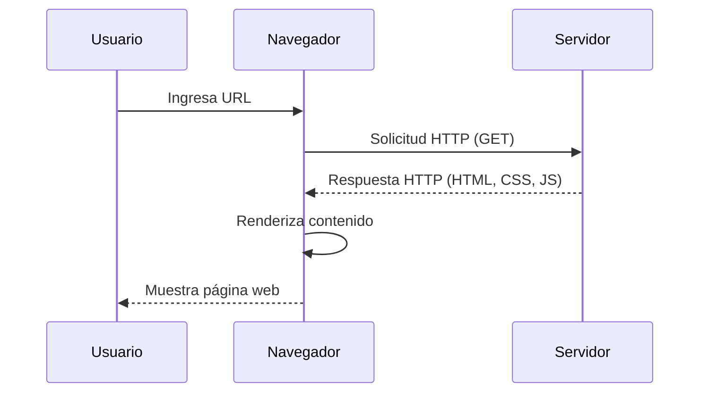
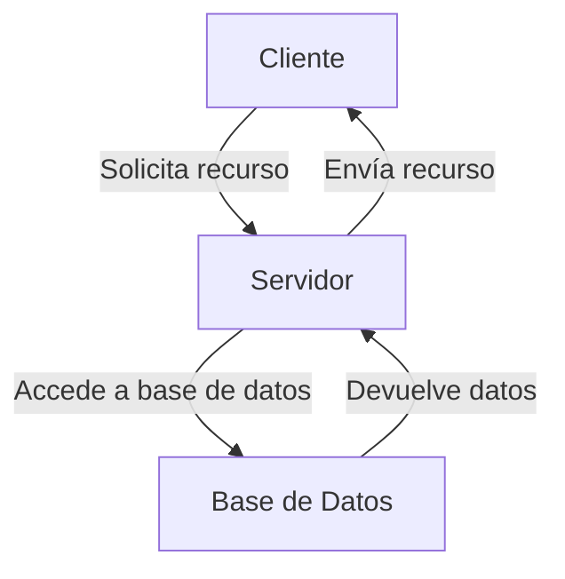

## Desarrollo de Aplicaciones Web

### Navegadores
Los navegadores son software que permite a los usuarios acceder y visualizar contenido en la web. Algunos de los navegadores más populares son **Google Chrome**, **Mozilla Firefox**, **Safari**, **Microsoft Edge** y **Opera**. Cada navegador tiene sus propias características y motores de renderizado, lo que puede afectar la forma en que se muestra el contenido web y cómo se ejecutan los scripts.

### Funcionamiento de los Navegadores. Protocolo HTTP
El funcionamiento de un navegador se basa en el **Protocolo de Transferencia de Hipertexto (HTTP)**, que es el protocolo fundamental para la comunicación en la web. Cuando un usuario ingresa una URL o hace clic en un enlace, el navegador envía una **petición HTTP** al servidor que aloja el recurso solicitado. Esta petición incluye información sobre el tipo de recurso que se desea obtener y el navegador que la está realizando. El servidor, a su vez, responde con el contenido solicitado, que puede ser un documento HTML, imágenes, o archivos CSS y JavaScript.

### Arquitectura Cliente y Servidor
La arquitectura de las aplicaciones web se basa en un modelo **cliente-servidor**. En este modelo, el **cliente** (generalmente un navegador web) realiza solicitudes al **servidor**, que es donde se almacenan y procesan los datos. El servidor responde a las solicitudes del cliente enviando los recursos necesarios. Esta interacción permite que los usuarios accedan a aplicaciones y servicios en línea desde cualquier lugar con conexión a Internet.

### Intérprete de Código Web
Los navegadores incluyen intérpretes que procesan diferentes tipos de código. Por ejemplo, el **motor de renderizado** interpreta el HTML y CSS para mostrar la página, mientras que el **intérprete de JavaScript** ejecuta scripts que pueden modificar el contenido de la página de manera dinámica. Cada navegador utiliza diferentes motores e intérpretes; por ejemplo, Chrome utiliza el motor **Blink** y el intérprete **V8**, mientras que Firefox utiliza **Gecko** y **SpiderMonkey**.

### ¿Todos los Navegadores son Iguales?
No, **no todos los navegadores son iguales**. Aunque todos cumplen la función básica de mostrar contenido web, pueden diferir en su rendimiento, compatibilidad con estándares web, y características adicionales. Algunos navegadores pueden manejar ciertas tecnologías web de manera más eficiente que otros, lo que puede afectar la experiencia del usuario. Además, la forma en que cada navegador interpreta y ejecuta el código puede variar, lo que puede llevar a diferencias en la visualización de las páginas web.

### Tecnologías de Desarrollo Web

| Tecnología       | Descripción                                                                                                                                                                                                 | Logo                                                                                          |
|------------------|-------------------------------------------------------------------------------------------------------------------------------------------------------------------------------------------------------------|-----------------------------------------------------------------------------------------------|
| **HTML**         | **HTML (HyperText Markup Language)** es el lenguaje de marcado estándar para crear páginas web. Permite estructurar el contenido en la web mediante el uso de etiquetas que definen elementos como encabezados, párrafos, enlaces, imágenes, y más. Es fundamental para cualquier desarrollo web, ya que proporciona la base sobre la cual se construyen las aplicaciones y sitios web. | <figure markdown="span">{ width="300" }</figure> |
| **CSS**          | **CSS (Cascading Style Sheets)** es el lenguaje utilizado para describir la presentación de un documento HTML. Permite aplicar estilos a los elementos HTML, como colores, fuentes, márgenes y diseño en general. CSS es esencial para crear interfaces atractivas y responsivas que mejoren la experiencia del usuario. | <figure markdown="span">{ width="300" }</figure> |
| **JavaScript**   | **JavaScript** es un lenguaje de programación que permite implementar funcionalidades complejas en las páginas web. Con JavaScript, se pueden crear interacciones dinámicas, manipular el DOM (Document Object Model), y realizar solicitudes asíncronas a servidores, lo que permite la creación de aplicaciones web más interactivas y dinámicas. | <figure markdown="span">{ width="300" }</figure> |

#### Frameworks de desarrollo del lado Cliente

##### Diseño
| Framework       | Descripción                                                                                                                                                                                                 | Logo                                                                                          |
|------------------|-------------------------------------------------------------------------------------------------------------------------------------------------------------------------------------------------------------|-----------------------------------------------------------------------------------------------|
| **Bootstrap**     | Es un framework CSS que proporciona un conjunto de herramientas predefinidas para el diseño web responsivo. Facilita la creación de interfaces atractivas y adaptables a diferentes dispositivos.             |      |
| **Tailwind CSS**  | Es un framework CSS de utilidad que permite a los desarrolladores crear diseños personalizados de manera rápida y eficiente, utilizando clases predefinidas.                                                |   |

##### Desarrollo
| Tecnología       | Descripción                                                                                                                                                                                                 | Logo                                                                                          |
|------------------|-------------------------------------------------------------------------------------------------------------------------------------------------------------------------------------------------------------|-----------------------------------------------------------------------------------------------|
| **Angular**      | Un framework de JavaScript desarrollado por Google, ideal para construir aplicaciones web de una sola página (SPA). Proporciona una estructura robusta y herramientas para el desarrollo de aplicaciones complejas. |                 |
| **React**        | Una biblioteca de JavaScript para construir interfaces de usuario, desarrollada por Facebook. Es muy popular por su enfoque en componentes reutilizables y su eficiencia en la actualización del DOM.         |         |
| **Vue.js**       | Un framework progresivo para construir interfaces de usuario. Es conocido por su simplicidad y flexibilidad, permitiendo a los desarrolladores adoptar sus características de manera gradual.                  |                                        |
