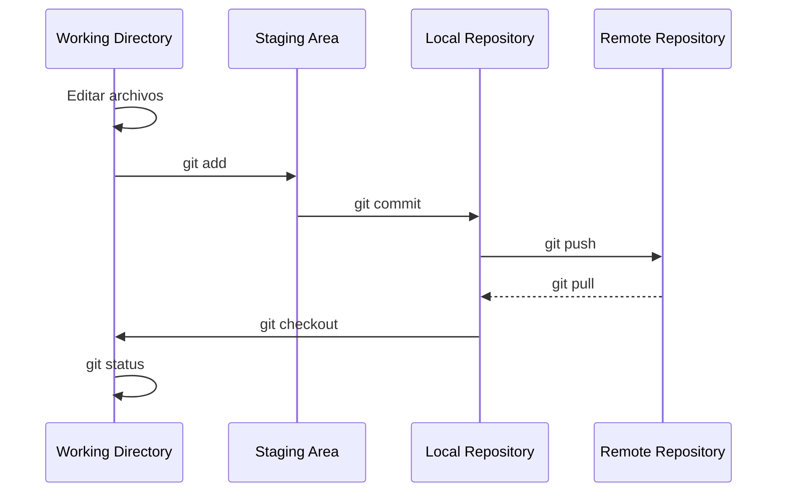

## Entorno de Desarrollo

### Control de Versiones 

**Git** es un sistema de control de versiones distribuido que permite a los desarrolladores rastrear, gestionar y revertir cambios en el código fuente a lo largo del tiempo. Es una herramienta fundamental para la colaboración eficiente en proyectos de software, ya que permite que varios desarrolladores trabajen simultáneamente sin conflictos. Git también facilita la creación de ramas (branches) para desarrollar nuevas características de manera independiente, permitiendo luego fusionarlas (merge) de manera controlada.

Git permite a los desarrolladores tener su propia **copia local del código**, trabajar en diferentes características o soluciones de errores sin interferir con el trabajo de otros. Una vez finalizados los cambios, pueden ser integrados en la rama principal (generalmente "main" o "master"). Esto asegura que el desarrollo sea modular y escalable.
  
#### Repositorios remotos
Los repositorios remotos permiten almacenar y gestionar el código de manera centralizada en servidores remotos o en la nube. Estas plataformas no solo proporcionan almacenamiento, sino también herramientas colaborativas como control de permisos, revisiones de código (pull requests) y CI/CD (Integración y Entrega Continua). Algunas de las plataformas más populares incluyen:

| Plataforma         | Descripción                                                                                                                                                                                                                                                                             | Logo                                                                                                           |
|--------------------|-----------------------------------------------------------------------------------------------------------------------------------------------------------------------------------------------------------------------------------------------------------------------------------------|----------------------------------------------------------------------------------------------------------------|
| **GitHub**         | GitHub es una de las plataformas más populares para alojar repositorios Git. Proporciona características como control de versiones, colaboración, gestión de proyectos y CI/CD. Permite repositorios públicos y privados, con una interfaz amigable para equipos de todo el mundo.           |                     |
| **GitLab**         | GitLab es una solución integral que ofrece alojamiento de repositorios Git, CI/CD y herramientas de gestión de proyectos. Su código abierto y la posibilidad de instalarlo en servidores privados lo hacen popular en grandes organizaciones.                                             |                            |
| **Bitbucket**      | Bitbucket permite almacenar repositorios de Git (y Mercurial) en la nube, con un enfoque fuerte en la integración con Jira y otras herramientas de Atlassian. Ideal para equipos que ya utilizan la suite de Atlassian. Ofrece tanto repositorios privados como públicos.                   |  |
| **Azure Repos**    | Parte de Azure DevOps, Azure Repos ofrece alojamiento de repositorios Git con integración directa con otros servicios de Microsoft, ideal para empresas que ya utilizan el ecosistema Azure. Permite la automatización de flujos de trabajo mediante pipelines CI/CD.                        |  |
| **AWS CodeCommit** | AWS CodeCommit es un servicio de control de versiones privado y seguro que se integra con otras herramientas de AWS. Ofrece una solución completamente gestionada y escalable, lo que lo convierte en una opción popular entre empresas que ya operan en la nube de Amazon.                  |                                     |

#### Ciclo de trabajo con Git

Este diagrama es claro y muestra el flujo de trabajo de Git, desde que haces cambios en el **Working Directory**, los añades al **Staging Area**, los confirmas en el **Local Repository**, y finalmente los subes al **Remote Repository** para colaborar con otros.

| Etapa                    | Descripción                                                                                                                                                                         | Comando importante                                                                 |
|--------------------------|-------------------------------------------------------------------------------------------------------------------------------------------------------------------------------------|------------------------------------------------------------------------------------|
| **Working Directory**     | Zona donde trabajas en tus archivos localmente. Aquí editas el código y haces los cambios.                                                                                          | `git status`: Revisar el estado de los archivos (modificados, nuevos o eliminados).|
| **Staging Area**          | Los archivozzzzs que deseas incluir en el próximo commit son añadidos aquí mediante el comando `git add`.                                                                               | `git add [archivo]`: Mover archivos al área de preparación.                        |
| **Local Repository**      | Una vez que los archivos están en el Staging Area, los confirmas al repositorio local con `git commit`. Esto guarda el historial de cambios localmente.                             | `git commit -m "mensaje del commit"`: Confirmar los cambios en el repositorio local.|
| **Remote Repository**     | Después de confirmar tus cambios localmente, puedes sincronizarlos con un repositorio remoto (como GitHub, GitLab o Bitbucket) mediante el comando `git push`.                      | `git push`: Enviar los cambios al repositorio remoto.                              |
| **git pull**              | Trae los cambios realizados en el repositorio remoto hacia el repositorio local, manteniendo tu trabajo sincronizado con el de otros colaboradores.                                | `git pull`: Obtener y fusionar cambios del repositorio remoto.                     |
| **git checkout**          | Cambia entre ramas o versiones del código, llevando el contenido de la rama seleccionada a tu Working Directory.                                                                    | `git checkout [rama]`: Cambiar a otra rama del código.                             |

### IDEs

Los **IDEs (Entornos de Desarrollo Integrados)** son herramientas que proporcionan un entorno completo para el desarrollo de software. Además de un editor de código, muchos incluyen herramientas para depurar, gestionar versiones y ejecutar proyectos. A continuación, se enumeran algunos de los principales IDEs utilizados en desarrollo web y otras áreas:

| **IDE**                | **Descripción**                                                                                                                                                                                                 | **Popularidad**                         | **Costo**                  | **Logo**                                                                                                 |
|------------------------|-----------------------------------------------------------------------------------------------------------------------------------------------------------------------------------------------------------------|----------------------------------------|----------------------------|----------------------------------------------------------------------------------------------------------|
| **Visual Studio Code**  | Un editor de código ligero pero potente de Microsoft, con soporte para múltiples lenguajes de programación mediante extensiones. Incluye depurador, terminal integrado y soporte para Git.                           | Muy alto, uno de los más populares    | Gratuito                   |    |
| **WebStorm**            | IDE especializado en JavaScript y tecnologías web modernas, desarrollado por JetBrains. Ofrece soporte avanzado para frameworks como React, Angular y Node.js.                                                      | Alto, muy popular entre desarrolladores web | Pago (con prueba gratuita) o Versión Community |   |
| **Sublime Text**        | Un editor de texto muy rápido y minimalista que puede ser ampliado con múltiples extensiones para soportar diversos lenguajes de programación. Ideal para desarrolladores que prefieren un editor ligero.             | Alto, muy usado en desarrollo ligero   | Pago (con prueba gratuita) o Versión Community |               |
| **Atom**                | Editor de código de GitHub, conocido por su alta personalización y su fuerte integración con Git. Es una opción flexible para desarrolladores web y cuenta con una gran variedad de extensiones.                       | Moderado, popular entre desarrolladores de GitHub | Gratuito                   |                     |