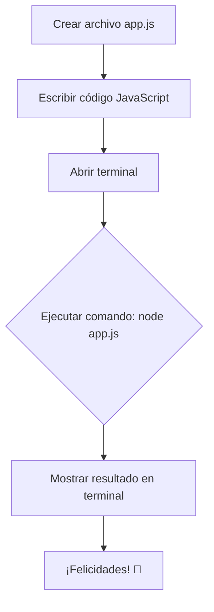

# Recursos y FAQ de JavaScript: ¡Todo lo que Necesitas Saber! 🚀📚

Bienvenido a tu guía definitiva de Recursos y Preguntas Frecuentes sobre JavaScript. Aquí encontrarás desde las mejores herramientas para aprender hasta respuestas a las dudas más comunes. Además, te enseñaremos cómo ejecutar un script de JavaScript usando Node.js, paso a paso, con diagramas interactivos y ejemplos de código. ¡Vamos a sumergirnos en el fascinante mundo de JavaScript! 🌐✨

### 📚 Recursos Imprescindibles para Aprender JavaScript

Para dominar JavaScript, necesitas los mejores recursos. Aquí te comparto los más útiles y recomendados:

- **MDN Web Docs**: La referencia definitiva para JavaScript. Detalles sobre funciones, métodos y buenas prácticas.
- **JavaScript.info**: Una guía completa y didáctica que va desde lo básico hasta conceptos avanzados.
- **Eloquent JavaScript**: Un libro interactivo y gratuito que te lleva a explorar JavaScript a profundidad con ejercicios prácticos.
- **Codecademy y freeCodeCamp**: Plataformas interactivas para aprender a programar JavaScript mientras escribes código.
- **Stack Overflow**: Resuelve todas tus dudas viendo cómo otros desarrolladores solucionan problemas similares.

### 💻 Guía para Ejecutar un Script de JavaScript con Node.js

Node.js es la herramienta perfecta para ejecutar JavaScript en tu computadora fuera del navegador. Esto te permite desarrollar aplicaciones backend, automatizar procesos y probar scripts de manera sencilla. A continuación, te explicamos cómo hacerlo paso a paso.

#### 🛠️ Paso 1: Instalar Node.js

Primero, debes instalar Node.js en tu computadora. Dirígete al sitio oficial de Node.js y descarga la versión más reciente. Una vez instalada, verifica la instalación con los siguientes comandos en tu terminal:

```bash
node -v  # Verifica la versión de Node.js
npm -v   # Verifica la versión de npm (Node Package Manager)
```

#### 📜 Paso 2: Crear tu Primer Script en JavaScript

Usa tu editor de código favorito (como Visual Studio Code) y crea un archivo llamado `app.js`. Dentro de este archivo, escribe tu primer script de JavaScript, por ejemplo:

```javascript
// app.js
console.log("¡Hola, Node.js! 🚀"); // Este mensaje se mostrará en la terminal
```

#### ▶️ Paso 3: Ejecutar tu Script con Node.js

Ahora, abre tu terminal, navega hasta la carpeta donde guardaste `app.js` y escribe el siguiente comando:

```bash
node app.js
```

Si todo ha ido bien, verás el mensaje `¡Hola, Node.js! 🚀` aparecer en tu terminal. ¡Felicidades, acabas de ejecutar tu primer script con Node.js! 🎉

#### 📊 Diagrama de Ejecución con Mermaid



### ❓ Preguntas Frecuentes sobre JavaScript

**1. ¿Qué es JavaScript?**  
JavaScript es un lenguaje de programación utilizado principalmente para crear páginas web dinámicas e interactivas. Además, gracias a Node.js, también se puede usar en el servidor para desarrollo backend.

**2. ¿Para qué sirve Node.js?**  
Node.js permite ejecutar JavaScript en el servidor, lo cual es ideal para crear aplicaciones web rápidas, APIs, y realizar tareas automatizadas.

**3. ¿Cuál es la diferencia entre `let`, `const` y `var`?**

- **`let`**: Permite declarar variables que pueden cambiar de valor y tiene un alcance de bloque.
- **`const`**: Declara variables cuyo valor no puede cambiar una vez asignado.
- **`var`**: Similar a `let`, pero tiene un alcance global o de función, lo que puede causar problemas de ámbito.

**4. ¿Qué es una Promesa en JavaScript?**  
Una Promesa es un objeto que representa la eventual finalización o falla de una operación asíncrona. Es ideal para manejar tareas como llamadas a APIs y otras operaciones que toman tiempo.

**5. ¿Cómo manejo errores en JavaScript?**  
Utiliza `try...catch` para capturar y manejar errores en tu código:

```javascript
try {
  // Código que puede fallar
  let resultado = 10 / 0;
  console.log(resultado);
} catch (error) {
  console.error("¡Ups! Algo salió mal: ", error);
}
```

### 🌟 Consejos y Buenas Prácticas

- **Escribe código limpio y comentado**: Facilita la lectura y mantenimiento del código.
- **Practica a diario**: La práctica constante es clave para dominar JavaScript.
- **Explora y comparte código**: Revisar el código de otros y colaborar con la comunidad es una excelente forma de aprender.
