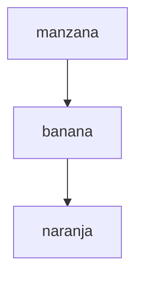
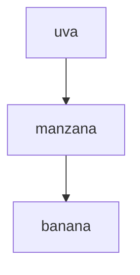
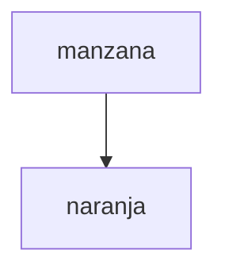
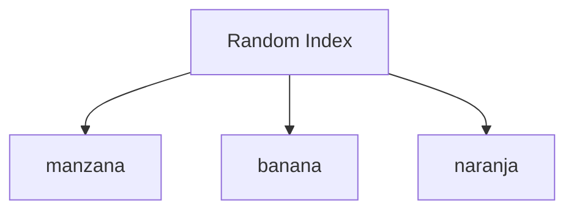

# 📚 Guía Básica de Arrays en JavaScript: Manipula tus Datos con Estilo 🚀

Trabajar con arrays es una de las habilidades esenciales para cualquier desarrollador JavaScript. Las operaciones básicas como añadir, eliminar y seleccionar elementos son la base de muchas aplicaciones y scripts. Aquí te mostramos cómo hacerlo de manera clara y visualmente atractiva, ¡para que le saques el máximo provecho a tus datos! 🧑‍💻

## 🛠️ Operaciones Básicas con Arrays en JavaScript

Los arrays son listas ordenadas de elementos, y aprender a manipularlos es clave. Vamos a ver cómo puedes trabajar con ellos con ejemplos prácticos y fáciles de seguir. 🎯

### 1. ➕ Añadir un Elemento al Final del Array (`push()`)

¿Quieres agregar algo al final de tu lista? `push()` es tu mejor amigo.

```javascript
const frutas = ["manzana", "banana"];
frutas.push("naranja"); // Añade "naranja" al final
console.log(frutas); // ["manzana", "banana", "naranja"]
```

**Diagrama:**



### 2. ⏪ Añadir un Elemento al Inicio del Array (`unshift()`)

Si necesitas insertar un elemento al principio, `unshift()` lo hace por ti.

```javascript
const frutas = ["manzana", "banana"];
frutas.unshift("uva"); // Añade "uva" al inicio
console.log(frutas); // ["uva", "manzana", "banana"]
```

**Diagrama:**



### 3. ❌ Eliminar el Último Elemento del Array (`pop()`)

Para eliminar el último elemento de tu array, `pop()` es la función indicada.

```javascript
const frutas = ["manzana", "banana", "naranja"];
frutas.pop(); // Elimina "naranja"
console.log(frutas); // ["manzana", "banana"]
```

### 4. 🗑️ Eliminar el Primer Elemento del Array (`shift()`)

Si deseas deshacerte del primer elemento, utiliza `shift()`.

```javascript
const frutas = ["manzana", "banana", "naranja"];
frutas.shift(); // Elimina "manzana"
console.log(frutas); // ["banana", "naranja"]
```

### 5. ✂️ Eliminar un Elemento en una Posición Específica (`splice()`)

`splice()` te permite eliminar elementos en una posición específica.

```javascript
const frutas = ["manzana", "banana", "naranja"];
frutas.splice(1, 1); // Elimina "banana" en la posición 1
console.log(frutas); // ["manzana", "naranja"]
```

**Diagrama:**



### 6. 🔍 Seleccionar un Elemento Específico por su Índice

Accede directamente a cualquier elemento por su índice. Fácil y rápido.

```javascript
const frutas = ["manzana", "banana", "naranja"];
console.log(frutas[0]); // Selecciona "manzana"
```

### 7. 🎲 Seleccionar un Elemento Aleatorio

Para seleccionar un elemento aleatorio, combina `Math.random()` y `Math.floor()`.

```javascript
const frutas = ["manzana", "banana", "naranja"];
const randomIndex = Math.floor(Math.random() * frutas.length);
console.log(frutas[randomIndex]); // Selecciona un elemento aleatorio
```

**Diagrama:**



---

Estas son las operaciones básicas que necesitas para manipular arrays en JavaScript sin complicaciones. ¡Practica estas técnicas y tendrás el control total de tus datos! 💡