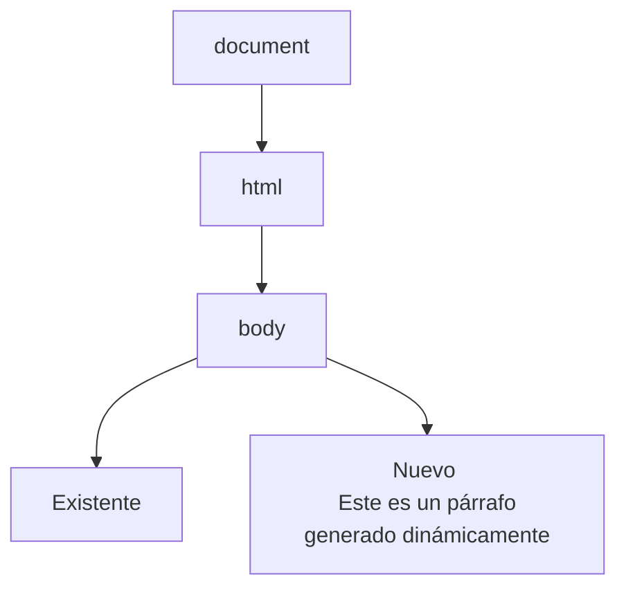
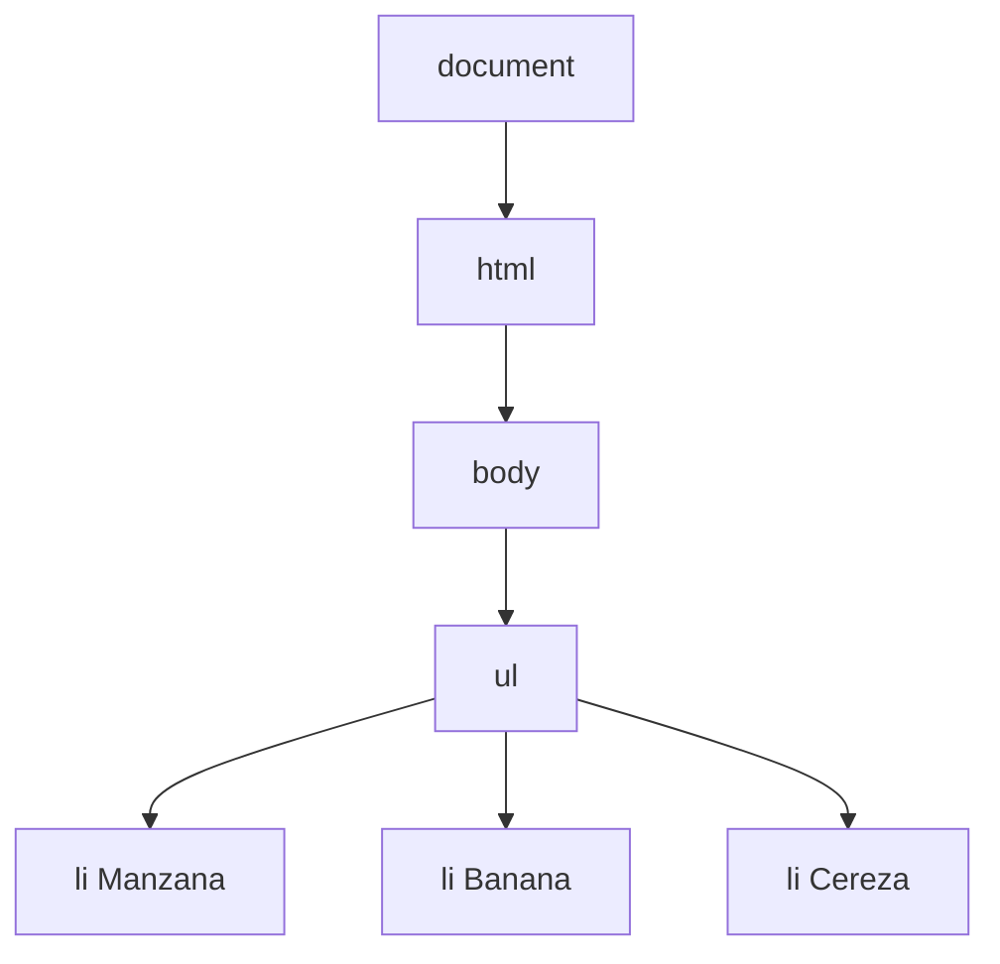
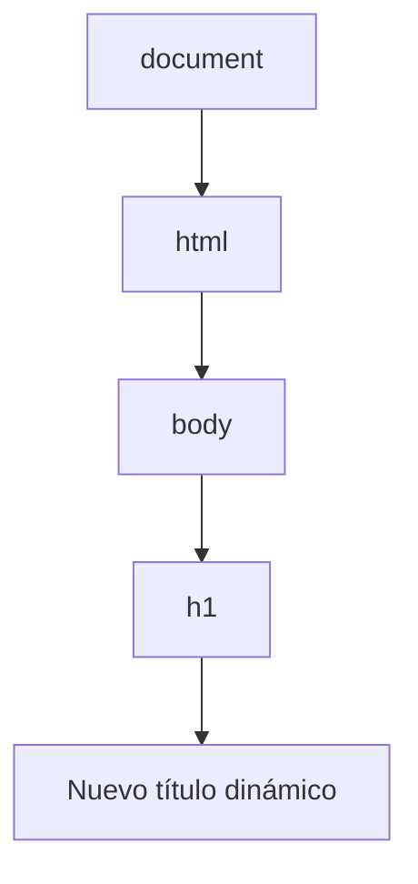
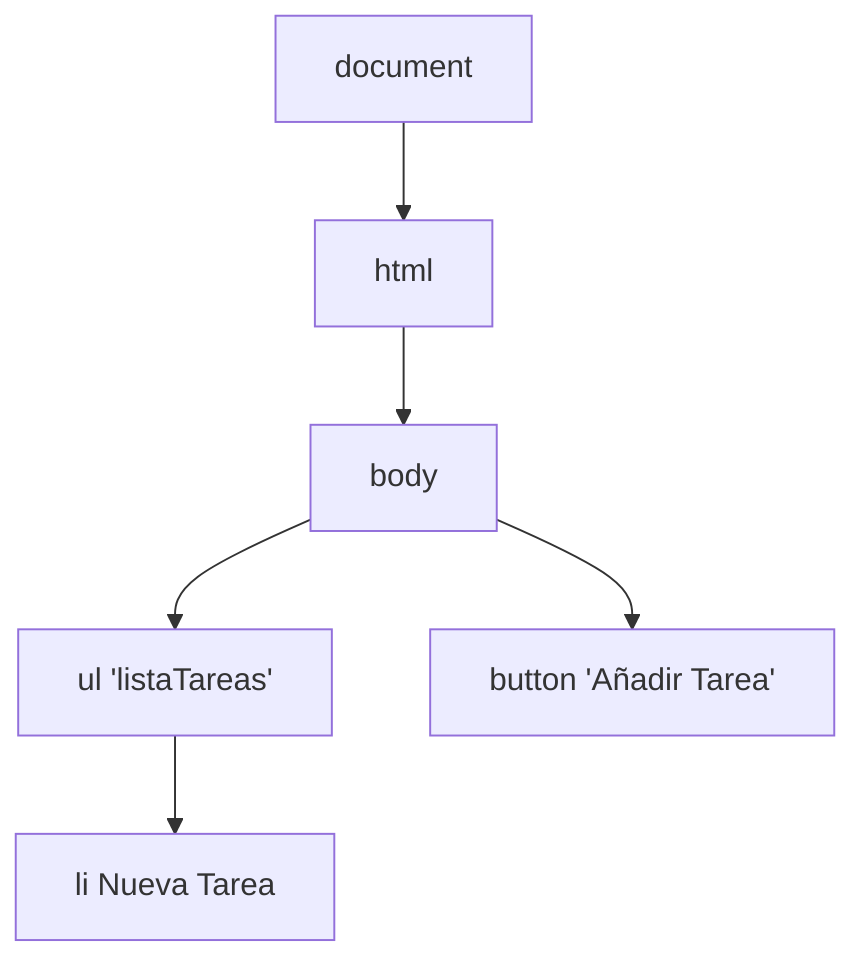
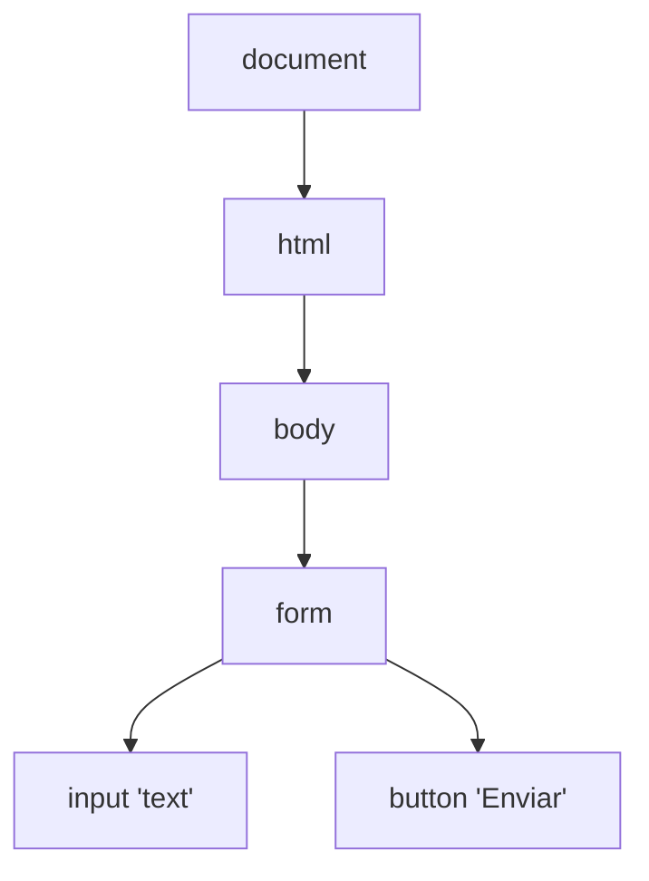
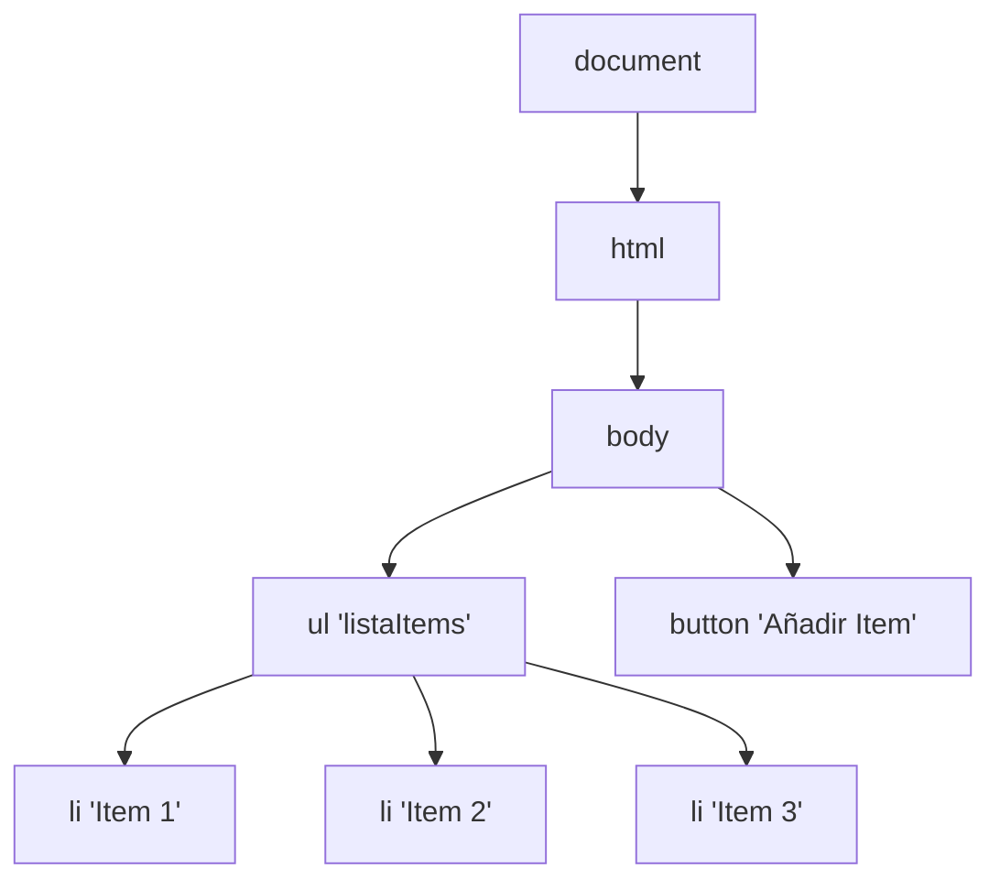

# 🌟 Generación de Texto y Elementos HTML desde Código en JavaScript

JavaScript es extremadamente poderoso cuando se trata de **generar y manipular elementos HTML** desde el código. Esta capacidad de modificar dinámicamente el DOM (Document Object Model) en tiempo real nos permite crear experiencias de usuario interactivas y más envolventes. Hoy veremos cómo crear y manipular elementos HTML, y cómo estos cambios afectan el DOM.

## 📚 **¿Qué es el DOM?**

El **DOM (Document Object Model)** es una representación estructurada del documento HTML. Es como un árbol, donde cada nodo representa una parte del documento (etiquetas, atributos, texto, etc.). Este árbol es manipulable con JavaScript, lo que nos permite crear, eliminar o modificar elementos del HTML directamente desde el código.

---

## 🏗️ **Crear y Añadir Elementos HTML desde JavaScript**

Usamos el método **`document.createElement()`** para crear nuevos elementos HTML. Luego podemos añadir estos elementos al DOM con métodos como **`appendChild()`**.

```javascript
// Crear un nuevo párrafo
let nuevoParrafo = document.createElement('p');
nuevoParrafo.innerText = 'Este es un párrafo generado dinámicamente';

// Añadir el párrafo al cuerpo del documento
document.body.appendChild(nuevoParrafo);
```

### 🧩 **Visualización en el DOM**:



En este caso, estamos añadiendo un nuevo párrafo dinámico al final del cuerpo (`body`) del documento.

---

## 🎨 **Añadir Listas Dinámicas**

Generemos una lista desordenada (**ul**) de elementos (**li**) basados en un arreglo de datos, como los nombres de frutas.

```javascript
let frutas = ['Manzana', 'Banana', 'Cereza'];

// Crear la lista desordenada
let listaFrutas = document.createElement('ul');

// Añadir elementos de lista dinámicamente
frutas.forEach(fruta => {
    let item = document.createElement('li');
    item.innerText = fruta;
    listaFrutas.appendChild(item);
});

// Añadir la lista al cuerpo del documento
document.body.appendChild(listaFrutas);
```

### 🧩 **Visualización en el DOM**:



En este ejemplo, generamos y agregamos dinámicamente una lista desordenada con tres elementos: **Manzana**, **Banana**, y **Cereza**.

---

## 🧱 **Modificación de Elementos Existentes**

Además de crear nuevos elementos, podemos **modificar elementos ya existentes** en el DOM usando métodos como **`getElementById()`** o **`querySelector()`** para seleccionarlos y luego modificar sus propiedades o su contenido.

```javascript
// Seleccionamos un elemento con ID 'titulo'
let titulo = document.getElementById('titulo');

// Cambiamos su texto
titulo.innerText = 'Nuevo título dinámico';
```

### 🧩 **Visualización en el DOM**:



Este ejemplo modifica el texto de un encabezado (`h1`) ya existente con el `id="titulo"`.

---

## 🎯 **Eventos Interactivos y Dinamismo en el DOM**

La verdadera magia sucede cuando combinamos la **creación dinámica de elementos** con **eventos** que responden a las interacciones del usuario. Veamos un ejemplo donde creamos un botón que, al hacer clic, añade una nueva tarea a una lista de tareas pendientes.

```javascript
// Crear lista y botón
let listaTareas = document.createElement('ul');
let botonAgregar = document.createElement('button');
botonAgregar.innerText = 'Añadir Tarea';
document.body.appendChild(listaTareas);
document.body.appendChild(botonAgregar);

// Añadir evento al botón
botonAgregar.addEventListener('click', () => {
    let nuevaTarea = document.createElement('li');
    nuevaTarea.innerText = 'Nueva Tarea';
    listaTareas.appendChild(nuevaTarea);
});
```

### 🧩 **Visualización en el DOM**:



En este caso, cada vez que el usuario hace clic en el botón "Añadir Tarea", se añade dinámicamente un nuevo elemento de lista al DOM.

---

## 🌐 **Generación Dinámica de Formularios**

JavaScript también permite generar **formularios completos** dinámicamente. Veamos cómo crear un formulario con un campo de texto y un botón de envío, y cómo podemos agregar validaciones básicas.

```javascript
// Crear el formulario
let formulario = document.createElement('form');

// Campo de texto
let campoNombre = document.createElement('input');
campoNombre.type = 'text';
campoNombre.placeholder = 'Escribe tu nombre';
formulario.appendChild(campoNombre);

// Botón de envío
let botonEnviar = document.createElement('button');
botonEnviar.type = 'submit';
botonEnviar.innerText = 'Enviar';
formulario.appendChild(botonEnviar);

// Añadir el formulario al documento
document.body.appendChild(formulario);
```

### 🧩 **Visualización en el DOM**:



Este código genera un formulario básico que incluye un campo de entrada de texto y un botón para enviar los datos.

---

## 🔄 **Manipulación Dinámica del DOM con Condiciones**

A veces queremos añadir o modificar elementos HTML en función de una condición. En el siguiente ejemplo, verificamos si el número de elementos de una lista es mayor a tres antes de permitir que se añadan más.

```javascript
let listaItems = document.createElement('ul');
document.body.appendChild(listaItems);

let botonAgregarItem = document.createElement('button');
botonAgregarItem.innerText = 'Añadir Item';
document.body.appendChild(botonAgregarItem);

botonAgregarItem.addEventListener('click', () => {
    if (listaItems.children.length < 3) {
        let item = document.createElement('li');
        item.innerText = `Item ${listaItems.children.length + 1}`;
        listaItems.appendChild(item);
    } else {
        alert('No puedes añadir más de 3 items');
    }
});
```

### 🧩 **Visualización en el DOM con Condiciones**:



En este ejemplo, después de que se han añadido tres elementos a la lista, aparece un mensaje de alerta indicando que no se pueden añadir más.

---

## 🚀 **Conclusión**

La **generación dinámica de elementos HTML con JavaScript** te permite crear páginas web más interactivas y personalizadas, basadas en las acciones del usuario o datos externos. A través de métodos como **`createElement()`**, **`appendChild()`**, y la manipulación directa del DOM, puedes generar contenido sobre la marcha y modificar la estructura del documento.

Ya sea para añadir elementos interactivos, formularios, o listas dinámicas, **JavaScript** es tu herramienta esencial para hacer que el contenido de tu página sea adaptable y flexible. ¡Es hora de experimentar y aprovechar todo el poder que JavaScript tiene para ofrecer en el DOM! 💻🎉