# 🚀 Aplicaciones Prácticas de los Marcos en JavaScript

JavaScript es un lenguaje tan flexible que permite crear estructuras de código reutilizables a través de **marcos (frameworks)**. Estos marcos, como **React**, **Vue**, **Angular**, y otros, están diseñados para **facilitar el desarrollo** de aplicaciones web dinámicas y potentes, proporcionando herramientas y estructuras que aceleran la creación de funcionalidades complejas.

A continuación, exploraremos cómo estos marcos pueden aplicarse en proyectos reales, y te mostraremos ejemplos claros de su uso. 🎯 

## 🧩 **1. Aplicaciones de Una Sola Página (SPA)**

Una de las aplicaciones más comunes de los marcos en JavaScript es la creación de **Single Page Applications (SPA)**. Este tipo de aplicaciones cargan todo el contenido HTML, CSS y JavaScript una sola vez, y luego permiten que el contenido de la página cambie dinámicamente sin recargar la página.

### Ejemplo con React

```javascript
import React, { useState } from 'react';

function App() {
  const [contador, setContador] = useState(0);

  return (
    <div>
      <h1>Contador: {contador}</h1>
      <button onClick={() => setContador(contador + 1)}>Incrementar</button>
    </div>
  );
}

export default App;
```

### 🌍 **¿Qué está pasando aquí?**
- Utilizamos el **estado** (`useState`) de React para manejar el valor del contador.
- Cuando el usuario hace clic en el botón, se actualiza el estado, lo que automáticamente actualiza la interfaz sin recargar la página.

#### 🧩 **Diagrama de Flujo de un SPA**

```mermaid
flowchart TD
    A[App se carga] --> B[Usuario interactúa]
    B --> C[Modificación del estado]
    C --> D[Re-renderizado del componente]
    D --> A
```



---

## 📱 **2. Aplicaciones Web Progresivas (PWA)**

Los marcos como **Angular** y **Vue** son ideales para crear **Progressive Web Apps (PWA)**, aplicaciones que combinan lo mejor de las webs y las aplicaciones móviles. Las PWAs son capaces de funcionar sin conexión, recibir notificaciones push y ser instaladas como aplicaciones nativas en dispositivos móviles.

### Ventajas de una PWA:
- **Funciona offline**: Gracias a **Service Workers**, tu aplicación puede funcionar sin conexión.
- **Instalable**: Se puede instalar directamente en el dispositivo del usuario, sin necesidad de pasar por tiendas de aplicaciones.
- **Rápida**: Carga instantáneamente, ofreciendo una experiencia similar a una app nativa.

### Ejemplo de configuración de PWA en Vue

```javascript
// vue.config.js
module.exports = {
  pwa: {
    name: 'Mi PWA',
    themeColor: '#4DBA87',
    msTileColor: '#000000',
    appleMobileWebAppCapable: 'yes',
    appleMobileWebAppStatusBarStyle: 'black',
  }
};
```

Este archivo de configuración convierte una aplicación Vue en una PWA, añadiendo soporte para instalar la app en dispositivos móviles y personalizando los colores y el aspecto.

#### 🧩 **Diagrama de Flujo de una PWA**

```mermaid
flowchart TD
    A[Usuario abre la aplicación] --> B[App carga datos desde cache]
    B --> C[Usuario interactúa offline]
    C --> D[Cuando vuelve la conexión, se sincronizan los datos]
```



---

## 💼 **3. Dashboards y Paneles de Control**

Otra aplicación muy común de los marcos es la creación de **dashboards interactivos**. Estos paneles permiten a los usuarios visualizar datos en tiempo real, y los frameworks son la solución perfecta para manejar la reactividad y la complejidad de las interfaces.

### Ejemplo con Angular

```typescript
import { Component } from '@angular/core';

@Component({
  selector: 'app-dashboard',
  template: `
    <div class="dashboard">
      <h1>Panel de Control</h1>
      <div *ngFor="let widget of widgets">
        <app-widget [data]="widget.data"></app-widget>
      </div>
    </div>
  `,
  styleUrls: ['./dashboard.component.css']
})
export class DashboardComponent {
  widgets = [
    { data: 'Widget 1 Data' },
    { data: 'Widget 2 Data' },
  ];
}
```

### 🌍 **¿Qué está pasando aquí?**
- Angular se utiliza para **iterar dinámicamente** sobre un conjunto de widgets y renderizarlos en un panel de control.
- Cada widget es un componente independiente, lo que facilita su reutilización y mantenimiento.

#### 🧩 **Visualización de un Dashboard**

```mermaid
graph TD
    A[Dashboard] --> B[Widget 1]
    A --> C[Widget 2]
    A --> D[Widget N]
    B --> E[Datos en tiempo real]
    C --> F[Gráficos interactivos]
    D --> G[Controles de usuario]
```



---

## 🎯 **4. Comercio Electrónico**

En proyectos de **e-commerce**, los marcos de JavaScript como **Next.js** (basado en React) y **Nuxt.js** (basado en Vue) ofrecen características que permiten la creación de sitios altamente optimizados para el SEO y la experiencia del usuario.

### Ejemplo de componente de producto en Next.js

```javascript
export default function Producto({ producto }) {
  return (
    <div>
      <h2>{producto.nombre}</h2>
      <p>{producto.descripcion}</p>
      <p>Precio: ${producto.precio}</p>
      <button>Añadir al carrito</button>
    </div>
  );
}
```

### Ventajas de usar frameworks para e-commerce:
- **Renderizado del lado del servidor (SSR)**: Mejora la velocidad de carga y la indexación en buscadores.
- **Componentización**: Cada parte de la tienda (como un producto o un carrito) es un componente reutilizable y fácil de gestionar.
  
#### 🧩 **Flujo en una Tienda de E-commerce**

```mermaid
flowchart TD
    A[Usuario visita la tienda] --> B[Selecciona producto]
    B --> C[Añadir al carrito]
    C --> D[Finalizar compra]
    D --> E[Confirmación y pago]
```



---

## 🧠 **5. Aplicaciones de Machine Learning en JavaScript**

Gracias a bibliotecas como **TensorFlow.js**, puedes incorporar **machine learning** en tus aplicaciones JavaScript utilizando frameworks como **React** y **Vue** para la interfaz.

### Ejemplo básico de TensorFlow.js

```javascript
import * as tf from '@tensorflow/tfjs';

// Crear un modelo simple de regresión lineal
const model = tf.sequential();
model.add(tf.layers.dense({units: 1, inputShape: [1]}));

model.compile({loss: 'meanSquaredError', optimizer: 'sgd'});

// Datos de entrenamiento
const xs = tf.tensor2d([1, 2, 3, 4], [4, 1]);
const ys = tf.tensor2d([1, 3, 5, 7], [4, 1]);

// Entrenar el modelo
model.fit(xs, ys, {epochs: 500}).then(() => {
  // Usar el modelo entrenado para predecir
  model.predict(tf.tensor2d([5], [1, 1])).print();
});
```

Con este código, puedes crear un modelo simple de regresión lineal directamente en el navegador y predecir valores en tiempo real.

#### 🧩 **Diagrama de Flujo de un Modelo de Machine Learning**

```mermaid
flowchart TD
    A[Entrenamiento del modelo] --> B[Modelo entrenado]
    B --> C[Predicción]
    C --> D[Mostrar resultados al usuario]
```



---

## 🚀 **Conclusión**

Los marcos en JavaScript ofrecen soluciones poderosas para una variedad de aplicaciones prácticas: desde la creación de **Single Page Applications (SPA)** y **Progressive Web Apps (PWA)**, hasta **dashboards interactivos** y **e-commerce**. La modularidad, escalabilidad y reactividad que brindan estos frameworks hacen que el desarrollo web sea más eficiente y dinámico, proporcionando experiencias de usuario atractivas e interactivas.

¿Listo para llevar tus habilidades de JavaScript al siguiente nivel? 💻 