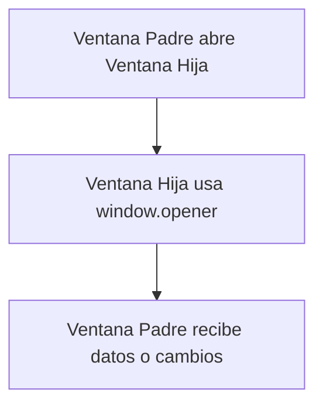
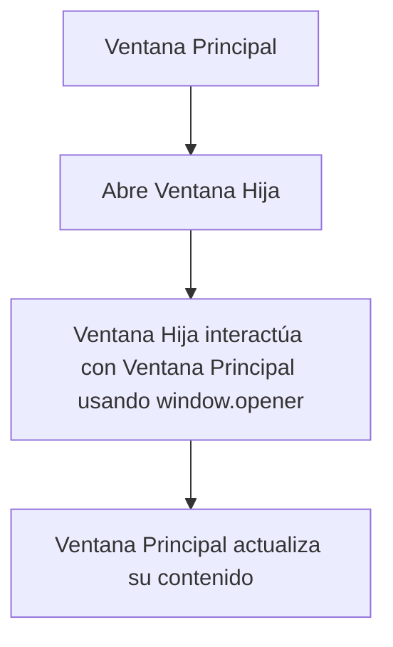

# 🪟 Creación de Nuevas Ventanas y Comunicación entre Ventanas en JavaScript

JavaScript te permite **abrir nuevas ventanas**, controlar su contenido y, lo que es aún más emocionante, **comunicarte entre las diferentes ventanas abiertas**. Estas funcionalidades son ideales cuando necesitas trabajar con varias vistas o procesos en paralelo dentro de una aplicación web. En este artículo, exploraremos cómo crear ventanas dinámicas y cómo intercambiar datos entre ellas de manera fluida. ¡Vamos a verlo! 🚀

---

## 🌟 **1. Creación de Nuevas Ventanas: `window.open()`**

El método **`window.open()`** es tu mejor amigo cuando quieres abrir una nueva ventana o pestaña en el navegador. Este método no solo abre una ventana nueva, sino que también te permite personalizar su tamaño, posición y características.

### 🖼️ **Sintaxis Básica de `window.open()`**

```javascript
window.open('https://www.ejemplo.com', '_blank', 'width=800,height=600');
```

### Parámetros:
- **URL**: La dirección que deseas abrir en la nueva ventana.
- **Target**: Puedes usar valores como `_blank` para abrir una nueva pestaña o `_self` para abrir en la misma ventana.
- **Características**: Puedes especificar atributos como el tamaño (`width`, `height`), si la ventana es redimensionable (`resizable`) y más.

#### 🌍 **Ejemplo Práctico: Ventana Emergente**

Imagina que deseas abrir una ventana emergente pequeña con información adicional:

```javascript
let ventanaInfo = window.open('https://www.info.com', 'ventanaInfo', 'width=400,height=300');
```

### 🧩 **Diagrama del Flujo de `window.open()`**

```mermaid
flowchart TD
    A[Usuario hace clic en el botón] --> B[window.open()]
    B --> C[Se abre una nueva ventana/pestaña]
    C --> D[Se carga el contenido especificado en la URL]
```

---

## 🔗 **2. Comunicación Entre Ventanas: `window.opener` y `postMessage()`**

Abrir ventanas es solo la mitad del trabajo. En muchas aplicaciones web, es necesario **enviar datos entre ventanas**. JavaScript te permite hacer esto de dos maneras principales: **`window.opener`** y **`postMessage()`**.

### 🔄 **2.1. Comunicación con `window.opener`**

Cuando una nueva ventana es creada con `window.open()`, esta ventana tiene una referencia a su ventana "padre" mediante el objeto **`window.opener`**. Esto permite que la nueva ventana interactúe directamente con la ventana que la abrió.

#### 🌍 **Ejemplo: Interactuando con la Ventana Padre**

```javascript
// En la ventana hija:
window.opener.document.getElementById('mensaje').innerText = '¡Mensaje desde la ventana hija!';
```

Este código permite a la ventana hija cambiar el contenido de un elemento en la ventana principal.

### 🧩 **Diagrama de Comunicación con `window.opener`**



### 📡 **2.2. Comunicación Segura con `postMessage()`**

Si deseas comunicarte de forma **más segura** entre ventanas (especialmente si las ventanas están en dominios diferentes), puedes utilizar **`postMessage()`**. Este método permite enviar mensajes específicos entre ventanas, con el beneficio de poder especificar de dónde aceptas los mensajes para evitar problemas de seguridad.

#### 🌍 **Ejemplo de `postMessage()`**

**En la ventana principal:**

```javascript
let nuevaVentana = window.open('https://www.ejemplo.com', '_blank');

// Enviar un mensaje a la nueva ventana
nuevaVentana.postMessage('Hola desde la ventana principal', 'https://www.ejemplo.com');
```

**En la ventana hija (receptora):**

```javascript
window.addEventListener('message', (event) => {
    if (event.origin !== 'https://www.ejemplo.com') {
        return; // Evitar mensajes de fuentes no confiables
    }
    console.log('Mensaje recibido:', event.data);
});
```

### 🧩 **Diagrama de Comunicación con `postMessage()`**

```mermaid
flowchart TD
    A[Ventana Principal envía mensaje] --> B[window.postMessage()]
    B --> C[Ventana Hija recibe el mensaje y lo procesa]
```

Este flujo permite un **intercambio seguro** de mensajes entre ventanas, asegurando que los datos solo provengan de fuentes confiables.

---

## 🖇️ **3. Ejemplos de Comunicación Dinámica Entre Ventanas**

### 📧 **Ejemplo 1: Cambiar el Contenido de la Ventana Principal desde la Ventana Hija**

**Ventana principal:**

```html
<!DOCTYPE html>
<html lang="es">
<head>
    <title>Ventana Principal</title>
</head>
<body>
    <h1 id="titulo">Hola desde la Ventana Principal</h1>
    <button id="btnAbrirHija">Abrir Ventana Hija</button>

    <script>
        document.getElementById('btnAbrirHija').addEventListener('click', () => {
            window.open('ventanaHija.html', 'ventanaHija', 'width=400,height=300');
        });
    </script>
</body>
</html>
```

**Ventana hija (`ventanaHija.html`):**

```html
<!DOCTYPE html>
<html lang="es">
<head>
    <title>Ventana Hija</title>
</head>
<body>
    <h1>Ventana Hija</h1>
    <button id="btnEnviarMensaje">Enviar Mensaje a Principal</button>

    <script>
        document.getElementById('btnEnviarMensaje').addEventListener('click', () => {
            window.opener.document.getElementById('titulo').innerText = '¡Mensaje desde la Ventana Hija!';
        });
    </script>
</body>
</html>
```

### 🧩 **Diagrama del Flujo del Ejemplo**



---

## 🌟 **4. Cerrar una Ventana Desde Otra**

A veces, es necesario cerrar una ventana desde la ventana que la abrió. Esto es posible utilizando **`window.close()`**, pero solo si la ventana fue abierta mediante **`window.open()`**.

### Ejemplo de Cierre de Ventana:

```javascript
// En la ventana principal
let ventanaHija = window.open('ventanaHija.html', '_blank');

// Después de unos segundos, cerrar la ventana hija
setTimeout(() => {
    ventanaHija.close();
}, 5000);  // Cierra la ventana después de 5 segundos
```

---

## 🚀 **Conclusión**

La **creación de nuevas ventanas** y la **comunicación entre ellas** son características poderosas de JavaScript que permiten crear aplicaciones web interactivas y dinámicas. Con **`window.open()`**, puedes abrir ventanas personalizadas, y con **`window.opener`** y **`postMessage()`**, puedes establecer **canales de comunicación eficientes y seguros** entre ellas.

¡Pon en práctica estos métodos para mejorar la experiencia de usuario en tus aplicaciones! 🌍🎉

### 🧑‍💻 **Resumen de Métodos Clave**
- `window.open()`: Abre una nueva ventana o pestaña.
- `window.opener`: Permite que la ventana hija se comunique con la ventana que la abrió.
- `postMessage()`: Envía mensajes entre ventanas de manera segura.
- `window.close()`: Cierra la ventana actual.

### 🧩 **Diagrama General del Flujo de Comunicación Entre Ventanas**

```mermaid
graph TD
    A[Ventana Principal] --> B[window.open()]
    B --> C[Ventana Hija creada]
    C --> D[Comunicación usando window.opener o postMessage]
    D --> E[Ventana Principal actualiza su estado]
```