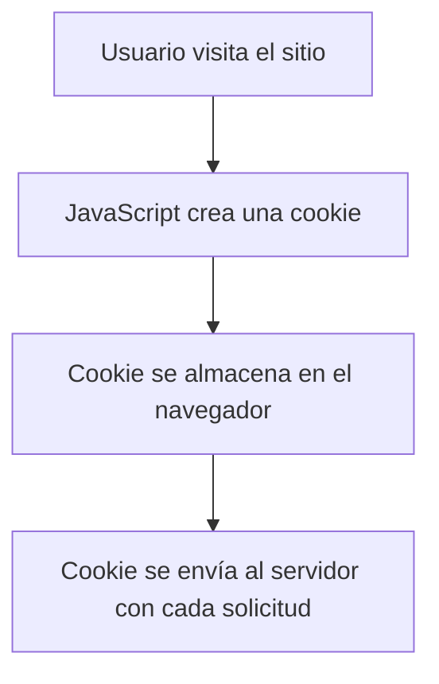
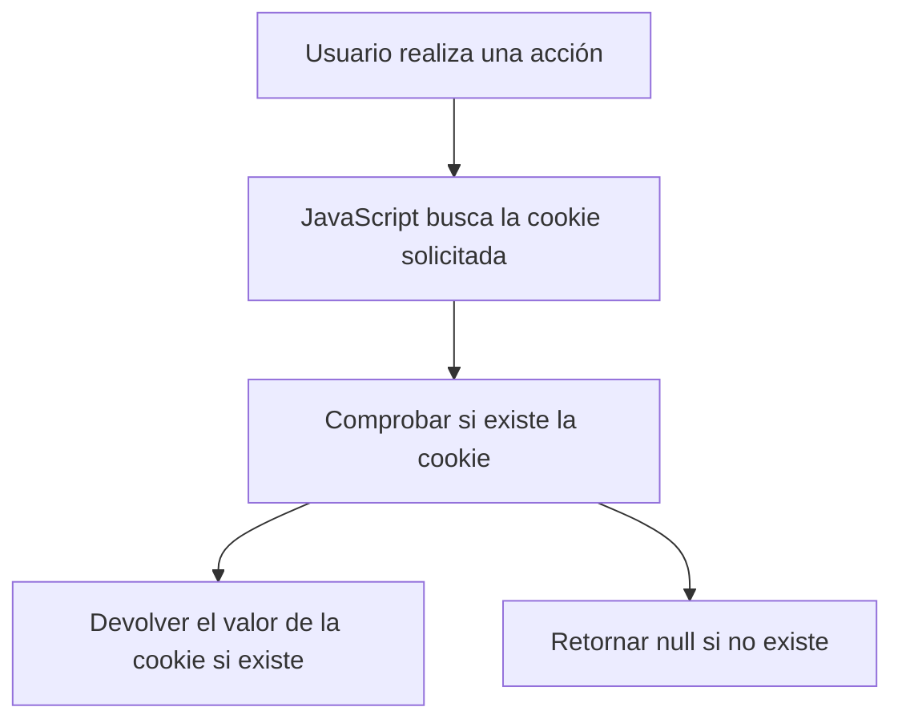
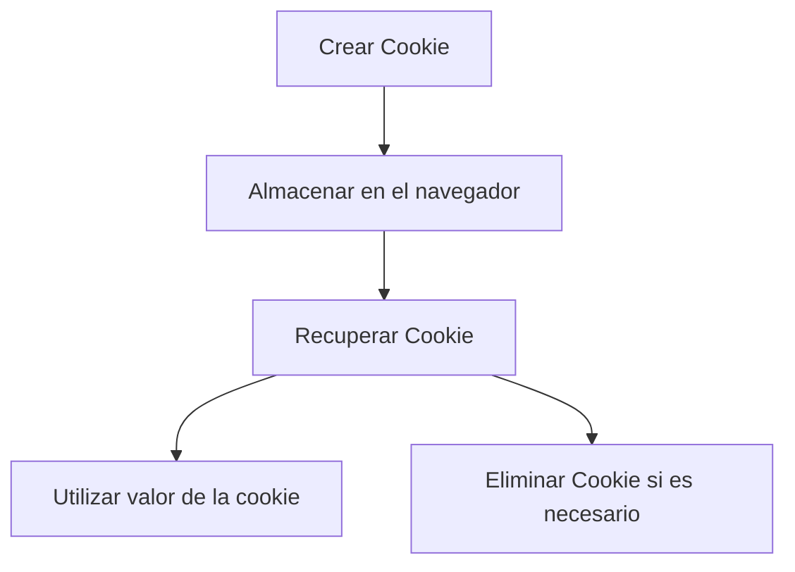

# 🍪 Todo Sobre Cookies en JavaScript: Definición, Creación, Almacenamiento y Recuperación

En JavaScript, **las cookies** son pequeños fragmentos de texto que se almacenan en el navegador del usuario. Se utilizan comúnmente para guardar información temporal como **sesiones de usuario, preferencias y seguimiento de actividad**. En este artículo, aprenderás qué son las cookies, cómo crearlas, almacenarlas, y cómo recuperarlas en tus proyectos. 🍪✨

---

## 🌐 **1. ¿Qué es una Cookie?**

Una **cookie** es un archivo pequeño que un sitio web guarda en el navegador del usuario cuando éste lo visita. Cada cookie contiene **un par clave-valor** que almacena datos útiles para las interacciones posteriores con el sitio. Estas cookies son enviadas automáticamente al servidor cada vez que se hace una nueva solicitud, lo que permite mantener un **estado persistente** en el navegador.

Ejemplos de uso de cookies:
- Guardar información de inicio de sesión.
- Recordar la preferencia de idioma.
- Rastrear la actividad de un usuario en el sitio web.

---

## 🍳 **2. Cómo Crear una Cookie en JavaScript**

En JavaScript, las cookies se pueden **crear** directamente desde el código usando la propiedad **`document.cookie`**. ¡Es más fácil de lo que parece! 🤓

### 🔹 **Ejemplo Básico de Crear una Cookie**

```javascript
// Crear una cookie llamada "usuario" con valor "Juan" que expira en 7 días
let fechaExpiracion = new Date();
fechaExpiracion.setTime(fechaExpiracion.getTime() + (7 * 24 * 60 * 60 * 1000));  // 7 días
let expiracion = "expires=" + fechaExpiracion.toUTCString();
document.cookie = "usuario=Juan; " + expiracion + "; path=/";
```

### 🔥 **Explicación del Código:**
- **`document.cookie`**: Este es el método principal para manipular cookies en JavaScript.
- **`usuario=Juan`**: Esto establece el nombre y valor de la cookie.
- **`expires`**: Define cuándo expirará la cookie.
- **`path=/`**: Establece el camino donde la cookie es válida (en este caso, en todo el sitio).

---

## 🗃️ **3. Almacenamiento de Cookies**

Las cookies se **almacenan** en el navegador del usuario y se envían automáticamente al servidor con cada solicitud. Es posible configurar cookies para que **expiren** después de un cierto tiempo o al cerrar el navegador.

### 🍪 **Configurando Cookies con Expiración**

```javascript
// Crear una cookie con valor y fecha de expiración en 1 hora
let ahora = new Date();
ahora.setTime(ahora.getTime() + (1 * 60 * 60 * 1000));  // 1 hora
let expiracionHora = "expires=" + ahora.toUTCString();
document.cookie = "preferencia=oscuro; " + expiracionHora + "; path=/";
```

Con esta configuración, la cookie `preferencia=oscuro` será eliminada después de 1 hora, a menos que el usuario regrese al sitio y la actualice.

### 🧩 **Diagrama de Flujo de Creación de una Cookie**



---

## 🔍 **4. Recuperación de Cookies**

Ahora que sabes cómo crear y almacenar cookies, veamos cómo puedes **recuperarlas**. Desafortunadamente, **document.cookie** solo te da una cadena larga con todas las cookies disponibles, por lo que tendrás que hacer un poco de trabajo manual para extraer los valores que necesitas.

### 🛠️ **Ejemplo de Recuperación de una Cookie Específica**

```javascript
// Función para obtener una cookie por su nombre
function obtenerCookie(nombre) {
    let cookies = document.cookie.split(';');
    for (let i = 0; i < cookies.length; i++) {
        let cookie = cookies[i].trim();
        // Comprobar si la cookie empieza con el nombre buscado
        if (cookie.indexOf(nombre + '=') === 0) {
            return cookie.substring((nombre + '=').length, cookie.length);
        }
    }
    return null;  // Devolver null si no se encuentra la cookie
}

// Usar la función para obtener el valor de la cookie 'usuario'
let usuario = obtenerCookie('usuario');
console.log('Usuario:', usuario);
```

### 🔥 **Explicación del Código:**
- **`document.cookie.split(';')`**: Esto divide la cadena de cookies en un array donde cada cookie es un elemento.
- **Búsqueda**: Luego, la función busca la cookie cuyo nombre coincida con el que estás buscando.

---

## 🔒 **5. Configuración Avanzada de Cookies: Seguridad y Alcance**

### 🔐 **Cookies Seguras: `Secure`**
Si deseas asegurarte de que una cookie solo se envíe a través de conexiones seguras (HTTPS), puedes añadir la opción **`Secure`** al crearla:

```javascript
document.cookie = "token=abc123; Secure; path=/";
```

### 🌍 **Cookies Solo para Subdominios: `Domain`**
Puedes hacer que una cookie sea válida solo en ciertos subdominios usando el atributo **`Domain`**.

```javascript
document.cookie = "usuario=Juan; domain=ejemplo.com; path=/";
```

Esto significa que la cookie estará disponible en todos los subdominios de `ejemplo.com`, como `blog.ejemplo.com`.

### 🧩 **Diagrama de Flujo de Recuperación de una Cookie**



---

## ❌ **6. Eliminar Cookies**

Si quieres **eliminar una cookie**, simplemente puedes configurarla con una fecha de expiración que ya haya pasado.

### 🌍 **Ejemplo de Eliminación de una Cookie**

```javascript
// Eliminar una cookie estableciendo su fecha de expiración en el pasado
document.cookie = "usuario=; expires=Thu, 01 Jan 1970 00:00:00 UTC; path=/";
```

Este código eliminará la cookie llamada `usuario`, ya que su fecha de expiración es anterior a la fecha actual.

---

## 📋 **7. Ejemplo Completo: Creación, Almacenamiento y Recuperación de una Cookie**

Ahora que ya sabes cómo crear, almacenar y recuperar cookies, veamos un **ejemplo completo** de gestión de cookies en una página web.

```html
<!DOCTYPE html>
<html lang="es">
<head>
    <meta charset="UTF-8">
    <meta name="viewport" content="width=device-width, initial-scale=1.0">
    <title>Gestión de Cookies</title>
    <script>
        // Función para crear una cookie
        function crearCookie(nombre, valor, dias) {
            let fecha = new Date();
            fecha.setTime(fecha.getTime() + (dias * 24 * 60 * 60 * 1000));
            let expiracion = "expires=" + fecha.toUTCString();
            document.cookie = nombre + "=" + valor + ";" + expiracion + "; path=/";
        }

        // Función para obtener una cookie
        function obtenerCookie(nombre) {
            let cookies = document.cookie.split(';');
            for (let i = 0; i < cookies.length; i++) {
                let cookie = cookies[i].trim();
                if (cookie.indexOf(nombre + '=') === 0) {
                    return cookie.substring((nombre + '=').length, cookie.length);
                }
            }
            return null;
        }

        // Crear una cookie y mostrar su valor
        function gestionarCookies() {
            crearCookie('usuario', 'Juan', 7);
            let usuario = obtenerCookie('usuario');
            alert('El usuario almacenado es: ' + usuario);
        }
    </script>
</head>
<body>
    <button onclick="gestionarCookies()">Crear y Obtener Cookie</button>
</body>
</html>
```

Este ejemplo crea una cookie llamada `usuario` con el valor "Juan" y la almacena durante 7 días. Al hacer clic en el botón, se recupera la cookie y se muestra su valor en un cuadro de alerta.

---

## 🚀 **Conclusión**

Las cookies en JavaScript son herramientas poderosas para almacenar y recuperar datos del usuario en el navegador. Con lo que has aprendido hoy, puedes **crear cookies**, **almacenarlas** de manera segura, **recuperarlas** para personalizar la experiencia del usuario y **eliminarlas** cuando ya no sean necesarias.

¡Ahora que conoces todos los secretos de las cookies, es momento de poner manos a la obra y empezar a gestionar las cookies en tus aplicaciones web! 🍪💻

### 📝 **Resumen de Métodos Clave**
- **`document.cookie`**: Crear, leer y eliminar cookies.
- **`expires`**: Establecer la fecha de expiración de la cookie.
- **`Secure`**: Hacer que la cookie solo sea accesible en conexiones HTTPS.
- **`path`** y **`domain`**: Controlar dónde es válida la cookie.

### 🧩 **Diagrama General del Flujo de Gestión de Cookies**

