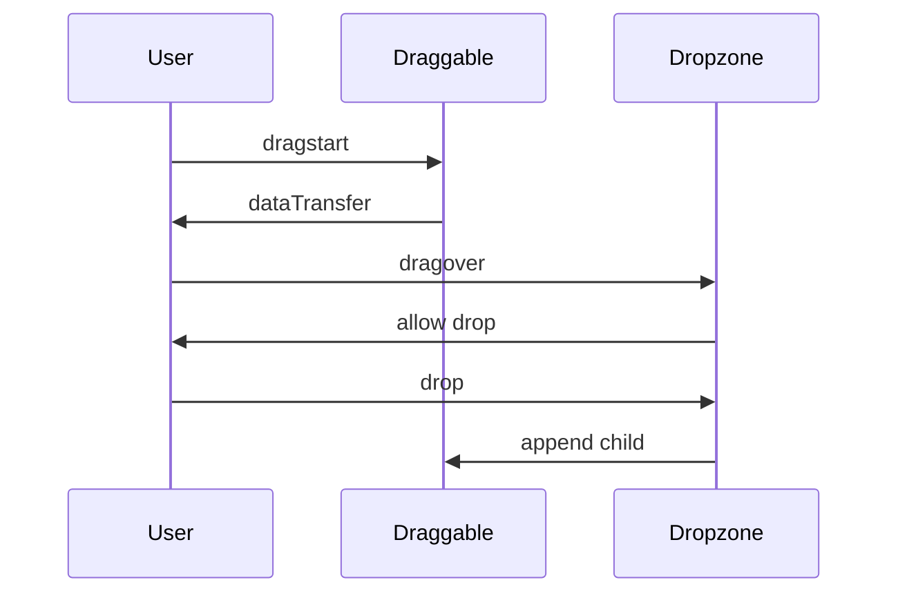

# Crear un Drag and Drop en JavaScript: Una Guía Completa

¡Vamos a aprender a crear un sistema de **drag and drop** usando JavaScript! Este tutorial te guiará a través de los conceptos básicos hasta la implementación de un ejemplo funcional. 🖱️✨

## Introducción al Drag and Drop

El **drag and drop** (arrastrar y soltar) es una funcionalidad interactiva en la que los usuarios pueden mover elementos de una parte de la interfaz a otra. Esta característica es clave en aplicaciones web modernas, mejorando la experiencia del usuario en sitios de comercio electrónico, tableros de tareas, organizadores visuales, y más.

### Paso 1: Configuración del HTML Básico

Vamos a empezar con una estructura básica de HTML. Necesitamos un contenedor para los elementos que se pueden arrastrar y una zona de destino para soltarlos.

```html
<!DOCTYPE html>
<html lang="es">
<head>
    <meta charset="UTF-8">
    <meta name="viewport" content="width=device-width, initial-scale=1.0">
    <title>Drag and Drop</title>
    <style>
        .container { display: flex; gap: 10px; }
        .dropzone { width: 200px; height: 200px; border: 2px dashed #aaa; display: flex; align-items: center; justify-content: center; }
        .draggable { width: 100px; height: 100px; background-color: #3498db; cursor: grab; }
    </style>
</head>
<body>

<div class="container">
    <div class="draggable" draggable="true" id="draggable">Arrástrame</div>
    <div class="dropzone" id="dropzone">Zona de destino</div>
</div>

</body>
</html>
```

### Paso 2: Añadir el JavaScript para Drag and Drop

Para que el arrastre y la soltura funcionen, necesitamos manejar algunos eventos clave de JavaScript: `dragstart`, `dragover`, y `drop`. Veamos cómo implementarlos.

```javascript
// Seleccionar elementos
const draggable = document.getElementById("draggable");
const dropzone = document.getElementById("dropzone");

// Evento para el inicio del arrastre
draggable.addEventListener("dragstart", (event) => {
    event.dataTransfer.setData("text/plain", event.target.id);
    draggable.style.opacity = "0.5";
});

// Permitir que el elemento se pueda soltar en la zona de destino
dropzone.addEventListener("dragover", (event) => {
    event.preventDefault();
    dropzone.style.borderColor = "#2ecc71";
});

// Evento para la acción de soltar
dropzone.addEventListener("drop", (event) => {
    event.preventDefault();
    const data = event.dataTransfer.getData("text");
    const element = document.getElementById(data);
    dropzone.appendChild(element);
    element.style.opacity = "1";
    dropzone.style.borderColor = "#aaa";
});
```

### Diagrama de Eventos Mermaid

Para visualizar la secuencia de eventos, aquí tienes un diagrama Mermaid de cómo ocurre el proceso de drag and drop:



## Explicación de los Eventos

- **dragstart**: Se dispara cuando el usuario empieza a arrastrar el elemento. Aquí, definimos qué datos vamos a transferir, en este caso, el `id` del elemento.
- **dragover**: Este evento permite que un elemento se suelte en un área específica. Sin `event.preventDefault()`, el `drop` no funcionará.
- **drop**: Se activa cuando soltamos el elemento sobre el área permitida. Aquí, obtenemos el `id` del elemento y lo añadimos como hijo de la zona de destino.

## Personalizando la Experiencia

Para mejorar la experiencia visual, puedes agregar estilos dinámicos en CSS, como un cambio de color en la zona de destino cuando está lista para recibir el elemento.

```css
.draggable:active {
    cursor: grabbing;
}
.dropzone.over {
    background-color: #e1eecf;
    border-color: #2ecc71;
}
```

## Resultado Final 🎉

Con estos pasos, tendrás un sistema funcional de drag and drop en tu página web. Este código es completamente personalizable, así que puedes ajustarlo según tus necesidades.

¡Feliz codificación y disfruta integrando esta funcionalidad interactiva en tus proyectos web! 🧑‍💻