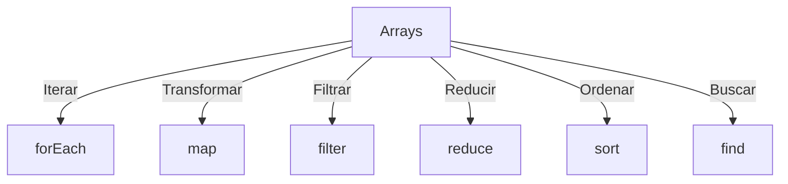

# 🌟 Dominando Arrays en JavaScript 🚀

## **Programación con Arrays**

### 📖 Introducción a los Arrays

Los arrays son estructuras de datos fundamentales en JavaScript que permiten almacenar múltiples valores en una sola variable. ¡Piénsalo como una lista mágica donde puedes guardar lo que quieras! 🌟

#### Características clave:
- 📂 **Versatilidad:** Maneja datos heterogéneos (números, cadenas, objetos).
- 🚀 **Flexibilidad:** Crece o decrece dinámicamente.
- 🔗 **Eficiencia:** Ideal para iteraciones y manipulaciones.

```javascript
const frutas = ["manzana", "banana", "naranja"];
console.log(frutas[0]); // manzana
console.log(frutas); // ["manzana", "banana", "naranja"]
```

---

### ✨ Definición y Creación de Arrays

#### 🛠️ Formas de crear arrays:
1. **Con literales (`[]`):**
   ```javascript
   const numeros = [1, 2, 3, 4, 5];
   const mezcla = ["texto", 42, true, { key: "value" }];
   console.log(numeros); // [1, 2, 3, 4, 5]
   console.log(mezcla); // ["texto", 42, true, { key: "value" }]
   ```

2. **Con el constructor `Array()`:**
   ```javascript
   const vacio = new Array(5);
   const inicializado = new Array(3, 6, 9);
   console.log(vacio); // [ <5 empty items> ]
   console.log(inicializado); // [3, 6, 9]
   ```

3. **Con `Array.of` y `Array.from`:**
   ```javascript
   const elementos = Array.of(7, "JS", true);
   const desdeIterador = Array.from("Hola Mundo");
   console.log(elementos); // [7, "JS", true]
   console.log(desdeIterador); // ["H", "o", "l", "a", " ", "M", "u", "n", "d", "o"]
   ```

#### 💡 Tip: Índice y longitud
Los índices comienzan en `0`. Puedes acceder a la longitud del array con `.length`.

```javascript
const array = [10, 20, 30];
console.log(array.length); // 3
console.log(array[array.length - 1]); // 30 (último elemento)
```

---

### 🔧 Métodos Básicos de Manipulación

#### 📥 Agregar elementos:
1. **`push(...elementos)`**
    - **Parámetros:** Uno o más elementos para añadir al final del array.
    - **Retorna:** La nueva longitud del array.
    ```javascript
    const colores = ["rojo", "azul"];
    colores.push("verde", "morado");
    console.log(colores); // ["rojo", "azul", "verde", "morado"]
    ```

2. **`unshift(...elementos)`**
    - **Parámetros:** Uno o más elementos para añadir al inicio del array.
    - **Retorna:** La nueva longitud del array.
    ```javascript
    colores.unshift("amarillo", "naranja");
    console.log(colores); // ["amarillo", "naranja", "rojo", "azul", "verde", "morado"]
    ```

#### 🗑️ Eliminar elementos:
1. **`pop()`**
    - **Parámetros:** Ninguno.
    - **Retorna:** El elemento eliminado (último del array).
    ```javascript
    colores.pop(); // Elimina "morado"
    console.log(colores); // ["amarillo", "naranja", "rojo", "azul", "verde"]
    ```

2. **`shift()`**
    - **Parámetros:** Ninguno.
    - **Retorna:** El elemento eliminado (primero del array).
    ```javascript
    colores.shift(); // Elimina "amarillo"
    console.log(colores); // ["naranja", "rojo", "azul", "verde"]
    ```

#### ✏️ Modificar y acceder:
1. **`splice(inicio, cantidad, ...elementosNuevos)`**
    - **Parámetros:**
        - `inicio`: Índice desde el cual iniciar.
        - `cantidad`: Número de elementos a eliminar.
        - `...elementosNuevos` (opcional): Elementos a insertar.
    - **Retorna:** Un array con los elementos eliminados.
    ```javascript
    colores.splice(1, 0, "rosa"); // Inserta "rosa" en el índice 1
    console.log(colores); // ["naranja", "rosa", "rojo", "azul", "verde"]
    ```

2. **`indexOf(valor, inicio)`**
    - **Parámetros:**
        - `valor`: Elemento a buscar.
        - `inicio` (opcional): Índice desde donde iniciar la búsqueda.
    - **Retorna:** El índice del primer elemento encontrado, o `-1` si no existe.
    ```javascript
    console.log(colores.indexOf("azul")); // 3
    ```

3. **`includes(valor, inicio)`**
    - **Parámetros:**
        - `valor`: Elemento a buscar.
        - `inicio` (opcional): Índice desde donde iniciar la búsqueda.
    - **Retorna:** `true` si el elemento existe, de lo contrario, `false`.
    ```javascript
    console.log(colores.includes("negro")); // false
    ```

---

### 🔄 Iteración de Arrays

#### ⚡ Métodos modernos:
1. **`forEach(callback(elemento, indice, array))`**
    - **Parámetros:**
        - `callback`: Una función que se ejecuta para cada elemento.
        - `elemento`: El valor actual.
        - `indice` (opcional): El índice del elemento.
        - `array` (opcional): El array completo.
    ```javascript
    colores.forEach((color, index) => {
        console.log(`Color ${index}: ${color}`);
    });
    ```

---

### 🎨 Transformación de Arrays

1. **`map(callback(elemento, indice, array))`**
    - **Parámetros:** Igual que `forEach`.
    - **Retorna:** Un nuevo array con los resultados de `callback`.
    ```javascript
    const duplicados = numeros.map(num => num * 2);
    console.log(duplicados); // [2, 4, 6, 8]
    ```

2. **`filter(callback(elemento, indice, array))`**
    - **Retorna:** Un nuevo array con los elementos que cumplen la condición.
    ```javascript
    const mayores = numeros.filter(num => num > 2);
    console.log(mayores); // [3, 4]
    ```

3. **`reduce(callback(acumulador, elemento, indice, array), valorInicial)`**
    - **Parámetros adicionales:**
        - `acumulador`: Valor acumulado.
        - `valorInicial`: Valor opcional para iniciar la acumulación.
    - **Retorna:** El valor acumulado final.
    ```javascript
    const suma = numeros.reduce((acc, num) => acc + num, 0);
    console.log(suma); // 10
    ```

### 🔧 Ordenación y Reorganización

1. **`sort(callback(a, b))`**
    - **Descripción:** Ordena los elementos de un array. Si no se proporciona una función de comparación (`callback`), los elementos se ordenan como cadenas de texto en orden lexicográfico.
    - **Parámetros:**
        - `a` y `b`: Dos elementos del array que se comparan. La función debe retornar:
        - Un número negativo si `a` debe aparecer antes que `b`.
        - Un número positivo si `a` debe aparecer después de `b`.
        - Cero si son iguales.
    - **Ejemplo:**
        ```javascript
        const numeros = [4, 1, 3, 2];
        const desc = numeros.sort((a, b) => b - a); // Ordena de mayor a menor
        console.log(desc); // [4, 3, 2, 1]
        ```

2. **`reverse()`**
    - **Descripción:** Invierte el orden de los elementos en el array.
    - **Parámetros:** Ninguno.
    - **Ejemplo:**
        ```javascript
        const invertido = desc.reverse();
        console.log(invertido); // [1, 2, 3, 4]
        ```

3. **`join(separador)`**
    - **Descripción:** Crea una cadena de texto a partir de los elementos de un array, separados por el valor del parámetro `separador`.
    - **Parámetros:**
        - `separador` (opcional): Cadena que se utiliza para separar los elementos. Si se omite, se usa una coma por defecto.
    - **Ejemplo:**
        ```javascript
        const texto = numeros.join(" - ");
        console.log(texto); // "1 - 2 - 3 - 4"
        ```

---

### 🔍 Búsqueda Avanzada

1. **`find(callback(elemento, indice, array))`**
    - **Descripción:** Retorna el primer elemento del array que cumple la condición especificada en el `callback`.
    - **Parámetros:**
        - `callback`: Una función que se ejecuta para cada elemento.
        - `elemento`: El valor actual del array.
        - `indice` (opcional): El índice del elemento actual.
        - `array` (opcional): El array completo.
    - **Ejemplo:**
        ```javascript
        const primero = numeros.find(num => num > 2);
        console.log(primero); // 3
        ```

2. **`findIndex(callback(elemento, indice, array))`**
    - **Descripción:** Similar a `find`, pero retorna el índice del primer elemento que cumple la condición, o `-1` si no se encuentra ninguno.
    - **Ejemplo:**
        ```javascript
        const indice = numeros.findIndex(num => num > 2);
        console.log(indice); // 2
        ```

---

### 🌌 Arrays Multidimensionales

1. **Descripción:** Los arrays multidimensionales son arrays que contienen otros arrays como elementos, permitiendo almacenar estructuras complejas como matrices o tablas.

2. **Acceso a elementos:**
   ```javascript
   const matriz = [
     [1, 2, 3],
     [4, 5, 6],
     [7, 8, 9]
   ];
   console.log(matriz[2][1]); // 8 (fila 3, columna 2)
   ```

3. **Aplanar arrays multidimensionales:**
    - **`flat(profundidad)`**
        - **Descripción:** Retorna un nuevo array con los elementos de los subarrays concatenados hasta la profundidad especificada.
        - **Parámetros:**
        - `profundidad` (opcional): Nivel de profundidad a aplanar. Por defecto es 1.
        ```javascript
        const plano = matriz.flat();
        console.log(plano); // [1, 2, 3, 4, 5, 6, 7, 8, 9]
        ```

---

### 📊 Diagrama de Métodos Comunes



---

### ⚡ Buenas Prácticas

1. **Usa métodos funcionales en lugar de bucles:**
   Los métodos como `map`, `filter` y `reduce` son más declarativos y concisos que los bucles tradicionales.

2. **Evita mutar arrays originales:**
   Usa copias con el operador de propagación (`...`) o métodos como `slice` para preservar el array original.
   ```javascript
   const original = [1, 2, 3];
   const copia = [...original, 4];
   console.log(copia); // [1, 2, 3, 4]
   ```

3. **Depura con herramientas como `console.table`:**
   Muestra arrays y objetos en un formato tabular para una mejor visualización.
   ```javascript
   const datos = [{ id: 1 }, { id: 2 }, { id: 3 }];
   console.table(datos);
   ```